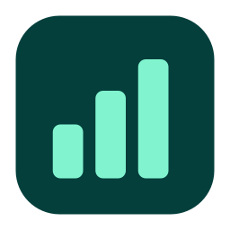

<p align="center"></p>

# codex-usage

**在 Windows / macOS 原生桌面查看 Codex 用量与账号额度。两端均支持预算提醒和任务监控。**

A native desktop companion for Codex: local token statistics and account quota, with budgets and task monitoring on both platforms. No browser required.

[使用文档站](https://asher-xunzhang.github.io/codex-usage/) · [发行记录](https://github.com/Asher-XunZhang/codex-usage/releases) · [仓内文档](docs/README.md) · [贡献指南](CONTRIBUTING.md)

## 下载与打开

| 平台 | 当前发行包 | 打开方式 |
| --- | --- | --- |
| Windows x64 | [v1.0.3 ZIP](https://github.com/Asher-XunZhang/codex-usage/releases/download/v1.0.3/codex-usage-desktop-v1.0.3-windows-x64.zip) · [SHA-256](https://github.com/Asher-XunZhang/codex-usage/releases/download/v1.0.3/codex-usage-desktop-v1.0.3-windows-x64.zip.sha256) | 完整解压到固定目录，运行 `CodexUsage.exe` |
| macOS Apple Silicon（M 系列） | [v1.0.3 ZIP](https://github.com/Asher-XunZhang/codex-usage/releases/download/v1.0.3/codex-usage-desktop-v1.0.3-AppleSilicon.zip) | 将 `Codex用量.app` 放入应用程序目录 |
| macOS Intel | [v1.0.3 ZIP](https://github.com/Asher-XunZhang/codex-usage/releases/download/v1.0.3/codex-usage-desktop-v1.0.3-Intel.zip) | 将 `Codex用量.app` 放入应用程序目录 |

**Windows 与 macOS 最新均为 v1.0.3。** 两端支持单窗口弧线调色、微弧融合贴边轮廓及按任务状态调整尺寸；Windows 此次还补齐通知关联消息、通知内暂停和账号额度开关。GitHub 自动生成的 **Source code** 是开发源码，不能直接作为应用打开。

Windows 包自带 .NET 与 Python，无需另装运行环境；请保留完整目录，不要单独移动 EXE。更新前从托盘菜单退出旧版本，再完整解压新包。用户配置与记录保存在 `%LOCALAPPDATA%\CodexUsageDashboard\desktop`，与程序目录分离。构建目标为 Windows 10 2004 及以上 x64，日常验证环境为 Windows 11；未提供 Windows ARM64 原生包。详见 [Windows 使用指南](docs/windows/README.md)。

macOS 安装助手固定安装 v1.0.3，自动选择芯片并校验 ZIP 和签名完整性，不需要 Python、Homebrew 或管理员密码。它会要求确认信任来源；当前 App 使用 ad hoc 签名，未经 Developer ID 签名或 Apple 公证。安装助手、手动安装、Intel 排障及验证边界见 [macOS 安装指南](docs/macos/INSTALL.md)。更新前退出并移走旧 App；保留支持目录和偏好即可继续使用原有数据。

## 三种查看方式

- **主面板**：按时间、模型与任务查看输入、输出、缓存、调用次数和每日趋势，支持明细搜索、排序与 CSV 导出。
- **系统托盘 / macOS 菜单栏**：快速查看今日用量、账号额度并打开主面板。两端均可查看摘要、打开详情和命令菜单，使用各平台原生交互。
- **圆形浮窗**：额度圆环、数值与深浅主题；悬停展开详情，可拖动并独立筛选。两端支持圆环与面板连续形变、展开后整窗拖动、四边自动隐藏和额度侧签。

浮窗在用量、预算和监控之间切换，底部固定保留“打开主面板”和“收起”。“保持展开”控制离开鼠标后是否收起；“更多 → 窗口行为”中的置顶控制窗口层级，两者独立。普通点击执行按钮；按住移动超过拖动阈值后只拖动。松手时才校正越界位置，下一次展开重新选择合适方向。

关闭主面板会释放该窗口及统计服务，常驻托盘和浮窗继续工作；隐藏浮窗保留可找回它的托盘入口。只有明确选择“退出”才结束整个工具。详细行为按平台阅读 [Windows 指南](docs/windows/README.md)或 [macOS 架构](docs/macos/ARCHITECTURE.md)。


以上为 v1.0.3 原生 AppKit 离屏渲染，使用合成数据；中间帧表示形变进度，不是账号额度。完整的[调色板说明](docs/macos/ARC-COLORS.md)和[四边贴合交互图解](docs/macos/FLOATING-1.0.3.md)包含深浅主题与任务状态示例。

## 预算提醒与任务监控

**两端预算提醒**支持 Token、估算金额和官方余量下限，按周期、模型或任务设置范围及阈值。金额使用自填模型单价估算，不是账单；缺少价格或记录不完整会明确显示。可暂停提醒，编辑草稿可恢复，浮窗可查看选中的预算。见 [Windows 预算提醒](docs/windows/BUDGETS.md)与 [macOS 预算提醒](docs/macos/BUDGETS.md)。

**两端均提供任务监控。** 独立选择任务，设置“本轮结束后提醒”或“每轮结束都提醒”。圆环、贴边侧签与托盘的小符号区分执行中、需要处理、已结束和状态待确认；额度弧与电池条继续表达额度，不冒充任务完成百分比。

浮窗监控页可查看任务、逐项取消监控、一键清理已结束的单轮监控，以及检查来源连接。取消监控只停止本工具的提醒，Codex 任务继续执行。通知默认无声，可仅保留应用内标记；不会自动展开浮窗或抢走当前页面。系统通知受系统权限与勿扰设置影响。见 [Windows 任务监控](docs/windows/TASK-MONITOR.md)与 [macOS 任务监控](docs/macos/TASK-MONITOR.md)。本轮结束不代表整个需求完成。

macOS 在两台显示器的接缝也支持松手贴合、移出后自动隐藏，侧签留在归属屏幕内；Windows 仍排除相连接缝。持续按住拖动可自由跨屏。

## 数据与隐私

- 统计对象是 Codex **已经写入本机日志**的记账。尚未落盘、记录缺口或无法核实的格式会影响覆盖范围。
- 输入包含缓存输入，输出包含推理输出，不能重复相加。Token、订阅额度和估算费用是不同口径。
- 未知额度显示“—”；旧快照标记为旧记录。重置卡仅显示数量，没有兑换入口。
- 两端手动刷新同时请求本地日志与账号额度，分别反馈结果；筛选失败保留重试入口，不把旧结果伪装为新范围。CSV 对应当前已确认的明细快照。
- 默认读取当前用户的 `~/.codex`，可选择其他来源目录。应用不上传聊天或统计；账号额度通过本机 Codex 的只读接口查询，Codex 自身可能与官方服务通信。

Windows 工具数据位于 `%LOCALAPPDATA%\CodexUsageDashboard\desktop`；macOS 位于 `~/Library/Application Support/CodexUsageDashboard/`，偏好位于 `local.codex-usage.desktop` 域。发行包不包含使用者的账号、任务日志、预算配置或数据库。

## 开发与验证

macOS 使用 Swift / AppKit，Windows 使用 C# / WPF，共用 Python 统计后端。主面板按需启动并释放；常驻形态不保留闲置的 Python 统计服务。Windows 父进程监测使用退出事件与停止事件等待；macOS 使用进程退出事件与可唤醒等待，兼容路径保留回退。新增监控与预算由宿主管理，不增加闲置常驻 Python 进程。

```sh
git clone https://github.com/Asher-XunZhang/codex-usage.git
cd codex-usage
python -B test.py
```

Windows 构建：`python -m tools.windows.build`。macOS 构建：`python3 -m tools.macos.fetch_runtime --arch arm64`，再运行 `python3 -m tools.macos.build --arch arm64`；Intel 将架构改为 `x86_64`。源码开发所需 SDK 与发行包自带运行时不同，具体前提见平台构建指南。

[仓库目录介绍](docs/common/PROJECT-STRUCTURE.md)说明 `src/`、`tools/`、`tests/` 与分平台资源的归属；旧脚本保留兼容入口。验证区分本机原生测试、合成事件、离屏绘制和实际发行包；另一平台的跳过项不计为通过。见 [Windows 验证范围](docs/windows/VALIDATION.md)、[macOS 验证记录](docs/macos/VALIDATION.md)与 [两端对齐清单](docs/common/WINDOWS-MACOS-ALIGNMENT.md)。

使用 agent 开发本仓时，从 [AGENTS.md](AGENTS.md)进入。另有可选的 [Token 查询技能与 Stop hook](docs/common/SKILL.md)，桌面程序不会自动安装它们。

## 许可证

本项目代码采用 [MIT](LICENSE)。随包运行组件遵循各自许可证，见 [第三方说明](THIRD-PARTY.md)。图标与示意图由项目代码生成。

本项目为独立工具，与 OpenAI 官方无隶属关系。
