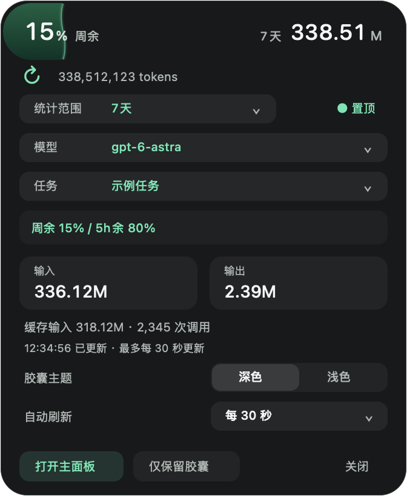
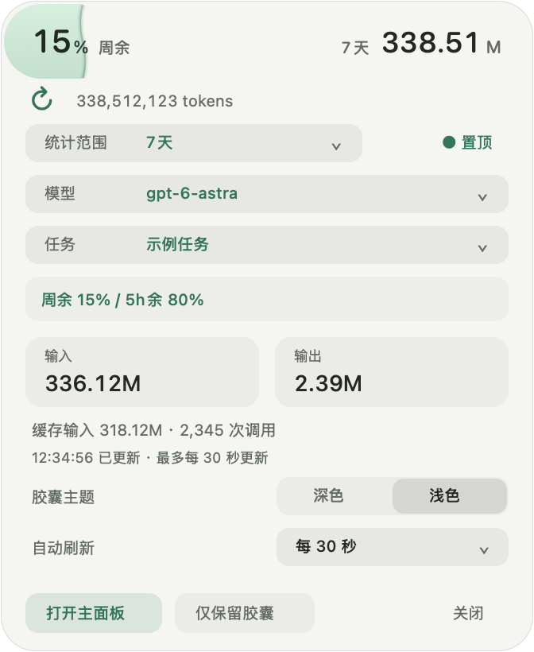

<p align="center"></p>

# codex-usage

**在 macOS 原生窗口、菜单栏和圆形浮窗中查看 Codex 用量。**

A native macOS companion for recorded Codex tokens and account quota. Local statistics, independent windows, no browser required.

[使用文档站](https://asher-xunzhang.github.io/codex-usage/) · [下载安装包](https://github.com/Asher-XunZhang/codex-usage/releases/latest) · [安装与 Intel 排障](docs/INSTALL.md) · [构建与开发](docs/BUILDING.md) · [架构](docs/ARCHITECTURE.md) · [验证范围](docs/VALIDATION.md)

## 直接使用

### 自动选择芯片并安装（推荐）

安装助手适用于 Intel 和 Apple Silicon，使用 macOS 自带工具，**不需要 Python、Homebrew、开发工具或管理员密码**。它固定安装正式发布的 **v1.0.1**，校验 ZIP 的 SHA-256 和 App 签名完整性，并安装到 `~/Applications/Codex用量.app`。

当前发行使用 ad hoc 签名，**未经过 Developer ID 签名或 Apple 公证**。助手会先展示来源、安装位置和操作说明，要求在终端输入 `install` 确认信任该发布；验证通过后，仅移除新安装这份 App 的隔离属性。SHA-256 与签名完整性校验不能替代开发者身份认证。这是免费的一次性安装方式，不是 Apple 公证，也不改变系统全局安全设置。

在「终端」中执行以下命令。脚本先保存为文件；也可先阅读 [安装助手源码](https://github.com/Asher-XunZhang/codex-usage/blob/main/scripts/install.sh)，再执行：

```sh
usage_installer_dir="$(mktemp -d "${TMPDIR:-/tmp}/codex-usage-install.XXXXXX")" &&
curl --fail --show-error --location --proto '=https' --proto-redir '=https' --tlsv1.2 \
  --connect-timeout 20 --max-time 60 --retry 2 \
  'https://github.com/Asher-XunZhang/codex-usage/releases/download/v1.0.1/install.sh' \
  --output "$usage_installer_dir/install.sh" &&
/bin/bash "$usage_installer_dir/install.sh"
```

已有同名 App 时，助手会停止，保留旧版本；按 [迁移说明](docs/INSTALL.md#已有版本迁移与卸载)处理后再试。助手不修改 `~/.codex`、历史用量或支持目录。离线安装、安装位置选择、PR 分支预览及完整排障见 [安装指南](docs/INSTALL.md)。

### 手动下载安装包

| Mac 芯片 | 下载文件 |
| --- | --- |
| Apple Silicon：M 系列 | [codex-usage-desktop-v1.0.1-AppleSilicon.zip](https://github.com/Asher-XunZhang/codex-usage/releases/download/v1.0.1/codex-usage-desktop-v1.0.1-AppleSilicon.zip) |
| Intel | [codex-usage-desktop-v1.0.1-Intel.zip](https://github.com/Asher-XunZhang/codex-usage/releases/download/v1.0.1/codex-usage-desktop-v1.0.1-Intel.zip) |

1. 在「 → 关于本机」确认芯片，使用 Safari 从上表下载匹配的原始 ZIP。GitHub 自动生成的 **Source code** 包用于开发，不能直接当作应用打开。
2. 完整解压，把 `Codex用量.app` 拖到「应用程序」，然后双击。无需另装 Python、Node.js、Homebrew 或开发工具；首次启动会校验并离线解压随包组件。
3. 安装并使用过 Codex 后，本工具读取这台 Mac 的本地记账；账号额度需要本机 Codex 已登录。首次历史索引可能需要等待。

互联网下载后，macOS 可能要求按 [Apple 的「仍要打开」流程](https://support.apple.com/en-us/102445)确认来源。若 Intel Mac 提示“应用程序无法打开”，见 [Intel 故障排查](docs/INSTALL.md#intel-提示应用程序无法打开)。组织管理策略可能限制运行，安装助手不能替代管理员授权。

构建最低目标为 macOS 11；已在 Apple Silicon/macOS 26.5 实测。一个实体 Intel/macOS 15.7.9 案例确认移除隔离属性后可启动，但这不代表所有 Intel 机型、系统版本或功能均已验收。

请从发行页下载与芯片匹配的原始 ZIP，并使用同名 `.zip.sha256` 文件核对完整性。发行包不包含任何用户的账号、历史用量或聊天记录；应用读取当前使用者本机的 Codex 记录。

## 三种查看方式

- **主面板**：今天、7/30/90 天或全部时间；按模型和任务筛选，查看输入、输出、缓存和调用次数；柱状图悬停显示精确数值，可搜索、排序、导出 CSV。
- **菜单栏**：快速查看今日 Token 与剩余额度。单击展开菜单，双击打开主面板；点击其它位置关闭菜单。
- **圆形浮窗**：76×76 的扁平圆环，5 点宽的弧线表示剩余额度。悬停立即展开详情，移开立即开始收起；支持深色/浅色、置顶、拖动，以及独立的时间、模型、任务筛选。

<p>
  
  
</p>
<p>
  
  
</p>

以上图片由真实绘制组件生成，使用固定演示数据，不代表某个账号的额度或记录。

当前源码中，收起弧线随剩余额度降低，由绿经过黄、橙平滑转为红色。整段剩余弧线使用同一种颜色；5% 及以下为警示红，0% 只保留底环，未知额度显示「—」。弧线对应上方「周余」等标签所指的账号额度，与下方筛选后的 Token 数量分别显示。深浅主题的色值和边界规则见 [额度弧线配色](docs/ARCHITECTURE.md#额度弧线配色)。

这项配色已包含在 [v1.0.1](CHANGELOG.md) 发行包中，上方收起示意图展示了 50% 剩余额度的琥珀色效果。

浮窗数字区左键打开主面板；右键或 Control-click 打开功能菜单；按住数字区移动超过 3 点时只拖动。选择菜单打开期间暂缓收起，可手动保持展开。动画遵循系统「减少动态效果」设置。

主面板关闭或隐藏时，菜单栏与浮窗继续运行；关闭浮窗不影响主面板。只有明确选择「仅状态栏」「仅保留胶囊」或「退出」才按其含义调整其它窗口。`⌘Q` 退出整个工具，`⌘H` 隐藏并释放主面板。

## 自定义预算与提醒（未发布）

主面板增加「预算与提醒」页面，可设置 Token、估算金额或官方余量下限，选择每天、每周、每月、一次性区间或固定时长周期。Token 与金额预算可指定模型和任务；每项预算的范围独立保存。提醒仅通过无声横幅和界面状态呈现，不会中断 Codex 任务。

菜单栏可查看前三项预算并进入管理页；浮窗展开后，在「用量 / 预算」之间切换并选择预算。预算模式的圆环、名称和数字对应同一项预算，切回用量保留原筛选。主面板隐藏或关闭后，监测由原来的常驻宿主继续负责。

默认在剩余 20%、10% 和 0% 时提醒，可调整阈值，暂停 30 分钟或本周期不再弹出。金额由手填模型单价估算，不是订阅账单；未知单价或不完整记录不会当作零。官方「期间消耗」口径暂不可启用，原因和全部行为见 [预算使用说明](docs/BUDGETS.md)。此功能尚未包含在 v1.0.1 下载包中。

## 刷新与统计口径

手动刷新立即请求增量扫描，完成后更新读数。自动刷新可关闭，或选择 1/2/5/10/30/60 秒、自定义 1–3600 秒；三种界面共享刷新间隔，各自的筛选范围独立保存。账号额度另按约 60 秒只读查询。

- 只能统计 Codex **已经写入本机日志**的记账；尚未落盘、缺失或旧格式无法核实的记录会标注覆盖限制。
- 输入已经包含缓存输入；输出已经包含推理输出，不能重复相加。
- Token 数量、账户订阅额度和费用是不同口径，不能相互反推。本工具不计算账单。
- 未知额度显示「—」，旧快照带标记。主面板可显示重置卡数量，**没有兑换入口**。

默认读取当前用户的 `~/.codex`，可在应用菜单中选择其它目录。索引、运行组件和工具日志位于 `~/Library/Application Support/CodexUsageDashboard/`；偏好位于 `local.codex-usage.desktop` 域。工具不上传聊天或统计。额度查询调用本机 Codex 的只读接口，可能由 Codex 自身与官方服务通信。

## 进程与内存

菜单栏与浮窗共用稳定的常驻 GUI，主面板使用按需启动的独立 GUI。主面板关闭后，它和 Python 统计服务一起退出，完整释放主面板的进程内缓存。详见 [架构与取舍](docs/ARCHITECTURE.md)。

| 状态 | 稳定时的进程 |
| --- | --- |
| 仅菜单栏或浮窗 | 1 个 GUI；没有闲置常驻 Python |
| 打开主面板 | 2 个 GUI + 1 个 Python 统计服务 |
| 扫描或查询额度期间 | 另有短时采集/摘要/额度进程，完成后退出 |

一次 Apple Silicon 实测：冷浮窗约 13.36 MiB；两次主面板开关并操作浮窗后，收起闲置约 24.83 MiB；随后暖机菜单栏约 25.81 MiB。系统菜单、字体和图形缓存有固定成本，不能承诺所有闲置状态低于 10 MB。短时查询峰值及测量边界见 [验证记录](docs/VALIDATION.md)。

## 源码与可选技能

```sh
git clone https://github.com/Asher-XunZhang/codex-usage.git
cd codex-usage
python3 test.py
python3 scripts/fetch_runtime.py --arch arm64
python3 build.py --arch arm64
```

本机源码构建需要 Apple Command Line Tools 和 Python 3.10+。Intel 构建将 `arm64` 改为 `x86_64`；两架构的离线运行组件均固定版本并校验 SHA-256。运行时归档不放进 Git 历史，发行 ZIP 已包含对应归档。

`skill/` 另保留可选的逐轮/任务 Token 统计技能与 Stop hook；它们不由桌面应用自动安装或启用。用法见 [可选技能](docs/SKILL.md)。

## 许可证

本项目代码使用 [MIT](LICENSE) 许可证。随包 CPython 和第三方组件遵循各自的许可证，见 [运行组件来源](resources/THIRD-PARTY.md) 和 [完整 notices](resources/third-party-licenses/)。图标及示意图由本项目代码生成。

本项目为独立工具，与 OpenAI 官方无隶属关系。

## Windows

提供用量、预算与任务监控。可选择正在执行的任务，设置本轮或每轮提醒，查看未读消息；取消监控只停止提醒，不会停止 Codex 任务。 Windows 使用、构建和验证请见 [Windows 说明](docs/WINDOWS.md)。macOS 已发布版本的安装链接保持不变。
