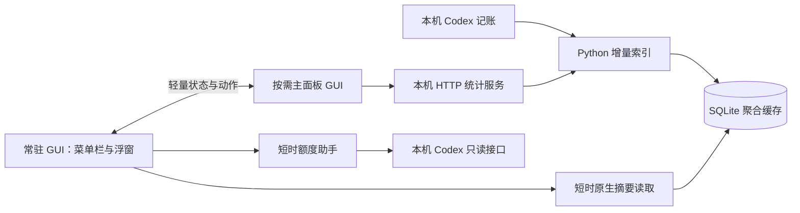

# 架构与取舍

## 窗口独立

宿主 bundle `local.codex-usage.desktop` 始终拥有状态栏和浮窗。主面板位于 `Contents/Helpers/CodexUsageMain.app`，bundle 为 `local.codex-usage.desktop.main`。两个角色共用编译后的代码，通过 bundle 身份按需创建界面；主面板不创建第二个状态栏或额度定时器。

普通显示、关闭、隐藏操作不替换宿主 PID。主面板关闭或隐藏时结束它自己的进程和统计服务，系统能回收该进程的全部界面缓存。仅通过显式「退出」关闭双方；「仅状态栏」「仅保留胶囊」保留其明确的排他显示含义。

`WindowProcess.swift` 处理启动、关闭、快速重开、重复实例和退出中的迟到消息。每种角色只有一个实例。关闭意图带时间信息，避免较晚收到的旧关闭消息覆盖新的打开操作。

## 索引与刷新

主面板打开时，其 Python 服务负责增量扫描；宿主通过短时 C/SQLite 读取器查询同一聚合缓存。主面板退出后，宿主仅在日志变化并达到刷新间隔时短暂启动 Python，另每 600 秒低频核对。关闭自动刷新时不自动扫描；首次没有数据、手动刷新或切换筛选仍可发起读取。

手动跨进程刷新带请求编号、忙碌状态、结果及超时恢复。启动前请求会在主面板就绪后重发；陈旧编号不能解除当前请求的忙碌状态。查询结果按范围、模型、任务及生命周期编号校验，避免显示过期快照。

## 界面成本

浮窗是同一个原生绘制视图，没有隐藏网页。收起时释放详情无障碍动作和临时选项列表，保留下一次即时展开所需的摘要；主题切换只更改同一视图的颜色和外观。动画有明确结束时间，没有闲置循环动画。

拆分的收益是主面板退出能彻底归还自身缓存，且不打断菜单栏与浮窗。代价是主面板打开时多一个 GUI 进程，需要同步偏好、动作和扫描所有权。宿主的 AppKit 字体、菜单和图形缓存仍可能驻留；不以重启宿主来换取每次收起后的低读数。

## 额度弧线配色

此节描述 v1.0.1 发行版的额度配色；此前 v1.0.0 发行包使用固定绿色弧线。实现位于 [`Sources/Capsule.swift`](../Sources/Capsule.swift) 的 `CapsuleQuotaColors` 与 `drawOrb()`，作用于浮窗收起时的额度圆弧。

弧长与颜色使用同一个剩余额度比例。整段剩余弧线只有一种颜色，随额度变化在下表相邻色点之间对 sRGB 分量作线性插值。例如 62.5% 位于 75% 和 50% 两种颜色之间，经过色点时连续过渡。两种主题的色点如下：

| 剩余额度 | 颜色 | 深色主题 | 浅色主题 |
| --- | --- | --- | --- |
| 100% | 翡翠绿 | `#35DE94` | `#009E68` |
| 75% | 黄绿色 | `#A5D76D` | `#708F30` |
| 50% | 琥珀色 | `#E9BC60` | `#AF811B` |
| 25% | 暖橙色 | `#F09858` | `#C97432` |
| 10% | 珊瑚红 | `#EE786E` | `#D76053` |
| 5% | 警示红 | `#EA6565` | `#D4474F` |

深色主题使用较明亮的颜色，浅色主题加深色值以保持辨识度。弧线表示当前「周余」等标签所指的账号额度；Token 数值仍由独立的时间、模型和任务筛选决定，不能用 Token 数量反推额度百分比。

- `0 < 剩余额度 ≤ 5%` 时保持警示红；0% 不绘制剩余弧线，只显示中性底环与 `0%`。
- 缺失或非有限额度显示「—」与中性底环；有限但越界的比例限制在 0–100%。
- 旧快照沿用该快照的颜色，并在数值后保留 `*` 标记。颜色不代表数据已经刷新。

两组色点各初始化一次。实际额度改变时，颜色读取现有 0.22 秒动画中的 `liquidFraction`，与弧长同步；没有新增闲置计时器或循环动画。浮窗隐藏、已展开或系统启用「减少动态效果」时，额度直接更新。主题切换继续复用同一个窗口和绘制视图。此变更没有重新测量整机内存，不能由色点数量推导完整应用的内存占用。

## 数据与权限

GUI 从聚合索引读取 Token 统计；账户额度由短时助手通过官方 Codex app-server 的固定只读方法取得。代码没有重置卡兑换动作。主面板 HTTP 服务仅监听 loopback，使用实例标识隔离请求，退出时清理自己的状态与进程。

共享偏好写入宿主域。宿主使用 `UserDefaults.standard`；主面板使用宿主 suite。Foundation 不允许以当前应用自身 bundle ID 初始化 suite，因此两个角色需要分别处理。共享域不可用时明确失败，避免静默写入错误偏好域。
