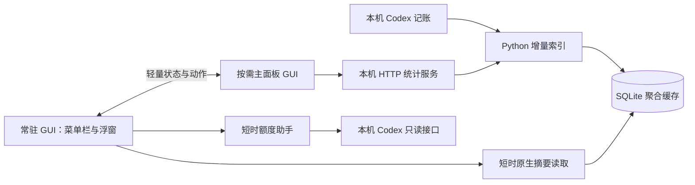

# 架构与取舍

## 窗口独立

宿主 bundle `local.codex-usage.desktop` 始终拥有状态栏和浮窗。主面板位于 `Contents/Helpers/CodexUsageMain.app`，bundle 为 `local.codex-usage.desktop.main`。两个角色共用编译后的代码，通过 bundle 身份按需创建界面；主面板不创建第二个状态栏或额度定时器。

普通显示、关闭、隐藏操作不替换宿主 PID。主面板关闭或隐藏时结束它自己的进程和统计服务，系统能回收该进程的全部界面缓存。仅通过显式「退出」关闭双方；「仅状态栏」「仅保留胶囊」保留其明确的排他显示含义。

`WindowProcess.swift` 处理启动、关闭、快速重开、重复实例和退出中的迟到消息。每种角色只有一个实例。关闭意图带时间信息，避免较晚收到的旧关闭消息覆盖新的打开操作。

## 索引与刷新

主面板打开时，其 Python 服务负责增量扫描；宿主通过短时 C/SQLite 读取器查询同一聚合缓存。主面板退出后，宿主仅在日志变化并达到刷新间隔时短暂启动 Python，另每 600 秒低频核对。关闭自动刷新时不自动扫描；首次没有数据、手动刷新或切换筛选仍可发起读取。

手动跨进程刷新带请求编号、忙碌状态、结果及超时恢复。启动前请求会在主面板就绪后重发；陈旧编号不能解除当前请求的忙碌状态。查询结果按范围、模型、任务及生命周期编号校验，避免显示过期快照。

刷新间隔和上次正间隔一起保存、同步，暂停后可恢复原自定义值。设置变更带独立编号，失败回滚只在宿主仍持有该编号时接收；同值的新变更也会重新同步后端。主面板发出的设置请求带递增 `refresh_revision`，后端在同一把条件锁内比较版本、更新并生成响应，避免已取消但仍在执行的旧 HTTP 请求覆盖新选择。后端重启后版本水位重置；未带版本的旧 API 调用保持兼容。

`RefreshInterval.swift` 提供按需创建的原生输入框。输入框本身不持有统计索引、后台服务或定时器；完成后断开编辑器、控件和闭包引用。浮窗输入期间暂停 hover/拖动切换，取消或应用后恢复指针判断；明确隐藏浮窗会取消尚未提交的输入。

## 界面成本

浮窗是同一个原生绘制视图，没有隐藏网页。收起时释放详情无障碍动作和临时选项列表，保留下一次即时展开所需的摘要；主题切换只更改同一视图的颜色和外观。动画有明确结束时间，没有闲置循环动画。

明确隐藏浮窗时会关闭并释放其窗口及绘制视图，重显时恢复位置、主题、置顶和独立筛选。收起和主题切换不会重建可见窗口。相同显示值不重复触发绘制通知；模型/任务菜单的数据转换在局部 autoreleasepool 内完成，临时 JSON 对象在进入菜单跟踪前释放。

回收请求在隐藏、输入框结束、菜单结束、刷新完成等释放事件后合并，最短间隔两秒；菜单、输入、拖动、动画、展开状态或采集忙碌时跳过。`malloc_zone_pressure_relief` 只能归还分配器可释放的空闲页，不会清除活对象或保证系统字体/图形缓存释放；普通悬停收起不额外触发分配器回收，也没有新增周期性回收定时器。

拆分的收益是主面板退出能彻底归还自身缓存，且不打断菜单栏与浮窗。代价是主面板打开时多一个 GUI 进程，需要同步偏好、动作和扫描所有权。宿主的 AppKit 字体、菜单和图形缓存仍可能驻留；不以重启宿主来换取每次收起后的低读数。

## 数据与权限

GUI 从聚合索引读取 Token 统计；账户额度由短时助手通过官方 Codex app-server 的固定只读方法取得。代码没有重置卡兑换动作。主面板 HTTP 服务仅监听 loopback，使用实例标识隔离请求，退出时清理自己的状态与进程。

共享偏好写入宿主域。宿主使用 `UserDefaults.standard`；主面板使用宿主 suite。Foundation 不允许以当前应用自身 bundle ID 初始化 suite，因此两个角色需要分别处理。共享域不可用时明确失败，避免静默写入错误偏好域。
