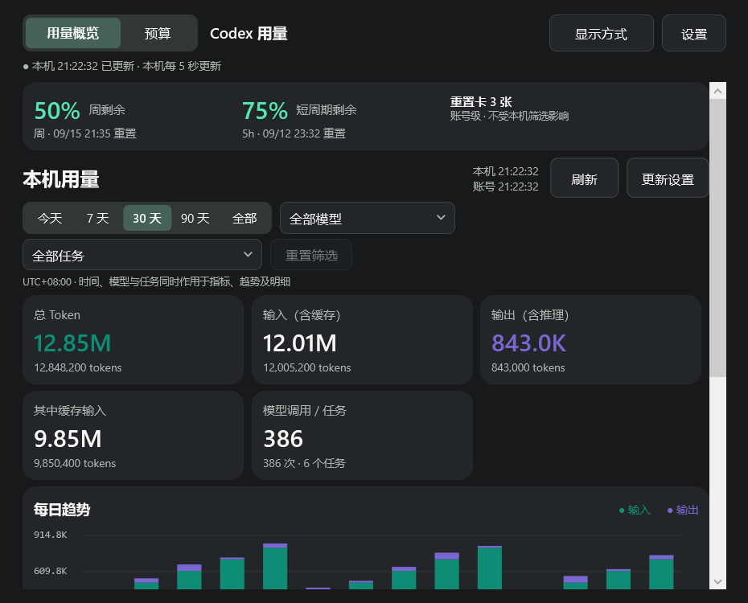
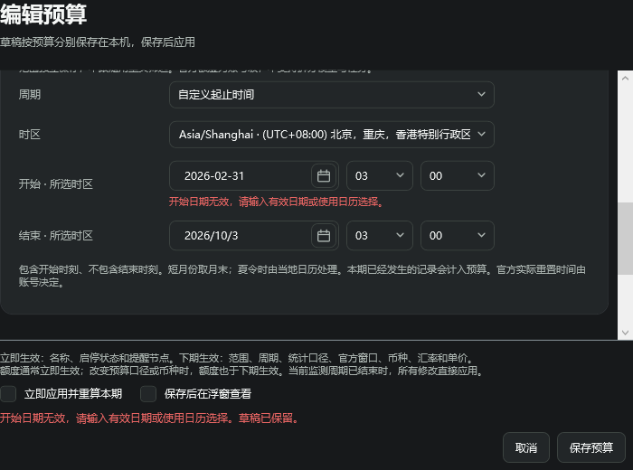
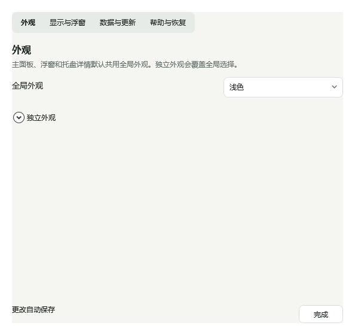
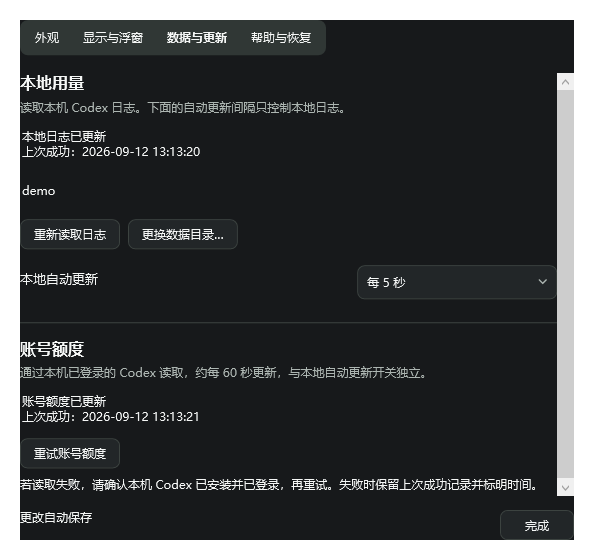
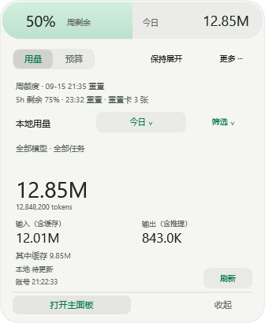
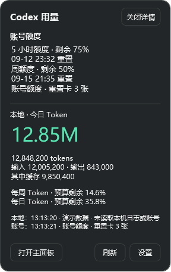

# Windows → macOS 功能与体验对齐清单

更新日期：2026-09-13。用途：供 macOS 维护者快速了解 Windows 已落地的变更、定位对应实现，并按行为验收迁移结果。

## 1. 比较基线与状态

- **macOS 基线**：`main` 提交 `f7f35c964bca7770405b169bdd3104f5a4c8e002`。这是源码基线，**不是已发布的 v1.0.1 安装包**；该提交已经包含尚未发布的预算功能。
- **Windows 对照**：v1.0.2 候选源码与该标签的公开发行。本文行为清单已更新；第 8 节图片保留内部 1.3.1 快照，仅用来说明当时的布局，不代表最终监控界面或后续拖动行为。
- **状态**：下文“已实现”指 Windows 当前源码已有对应行为；不表示 macOS 已同步，也不表示每种设备均已实测。任务监控及已知未完成项单列。
- **迁移原则**：对齐数据与操作后果，使用 AppKit 原生实现；不要求复制 WPF 模板、Win32 消息、Windows 字体或 Ctrl 快捷键。

文档优先级：本清单描述当前差异；[Windows 使用说明](../windows/README.md)描述当前操作与发行范围；[布局方案](../windows/LAYOUT-PROPOSAL.md)保存已确认设计；[历史 UX 审查](../windows/UX-REVIEW.md)是历史问题与建议，不能整体当作已完成清单。

快速看图：[主面板](#gallery-main) · [预算编辑](#gallery-budget) · [设置与选择器](#gallery-settings) · [圆环与展开面板](#gallery-floating) · [四边侧签](#gallery-edge) · [托盘详情](#gallery-tray)。每组图关联下文编号，点击可查看原始分辨率。

## 2. 沿用基线的能力，不应重复算作新增

| 能力 | 对齐边界 |
| --- | --- |
| 本地统计 | 时间、模型、任务筛选；输入／输出／缓存／调用；趋势、搜索、排序、CSV 均已有。日志解析、去重、增量索引、缓存格式和计数口径未修改。 |
| 账号额度 | 已有只读额度、重置时间、过期／未知状态与重置卡数量；没有兑换入口。额度与本地 Token 不能互相反推。 |
| 预算 | 已有 Token、估算金额、官方余量下限；五种周期、时区、独立范围、提醒阈值、暂停、去重、下期生效和立即重算。Windows 用 C# 实现等价规则，增强编辑与恢复体验。 |
| 浮窗 | 已有 76×76 圆环、336×410 展开面板、额度弧线及电池式填充、深浅主题、拖动、悬停、保持展开、置顶。Windows 改进形变、边缘交互和布局。 |
| 刷新 | macOS `manualRefresh()` 已请求本地日志与账号额度。Windows 的增量是两来源状态与错误独立、单来源重试，以及失败路径可靠性；不是首次增加双来源刷新。 |
| 进程与隐私 | 已有常驻宿主、按需主面板与短时采集，关闭主面板释放其进程／统计服务；不上传聊天记录，不新增模型调用。Windows 保留此架构。 |

基线入口：[Main.swift](../../src/macos/App/Main.swift)、[Capsule.swift](../../src/macos/Features/Floating/Capsule.swift)、[BudgetCore.swift](../../src/macos/Features/Budgets/BudgetCore.swift)、[Runtime.swift](../../src/macos/Infrastructure/Runtime.swift)。2026-09-13 目录整理后位于 `src/macos/`。发布 CI 另暴露了两处基线兼容问题：`Main.swift` 显式标注状态栏图形坐标的 `CGFloat` 类型，保持原绘制尺寸；[Summary.c](../../src/macos/Helpers/Summary.c) 在旧 SQLite JSON1 截断字符串前拒绝 JSON 空字符转义，同时保留合法字面量反斜杠。这些是原生源码的最小修复，并非 Windows UI 或预算功能同步；现有 macOS v1.0.1 下载未被替换。原生编译与行为结果仍以修复后 CI 为准。

## 3. Windows 已实现：建议 macOS 对齐的行为

编号用于后续 PR 引用；同一行同时给出实现目标与最小验收要求。Windows 初版的裁切、焦点和动画缺陷不代表 macOS 也有相同缺陷，应迁移行为约束并验证本平台。

### 数据一致性与保存恢复

效果参考：[主面板分区](#gallery-main)、[两来源更新设置](#gallery-settings)。

| 编号 | 优化／变更与验收要求 |
| --- | --- |
| D01 | **筛选与快照绑定**：将数据目录、缓存、查询条件及请求版本作为结果身份。切换范围先清除旧范围显示，丢弃迟到结果；失败维持待读取并重试，不能让旧数值挂在新筛选旁。 |
| D02 | **分开报告更新结果**：本地与账号各自显示进行中、成功时间和错误；一个来源失败不阻止另一个启动。手动刷新仍请求两者；本地自动更新只控制日志。设置和更新状态窗口提供分别重试，账号查询关闭时不擅自启用。 |
| D03 | **导出所见快照**：不再另发一次导出查询。默认导出当前显示行，含明细搜索与排序；可选当前范围全部行。范围读取失败／未完成时禁用导出；选择文件后捕获当前快照，写入期间来源、快照或当前显示行的搜索／排序变化则拒绝旧导出。基线 CSV 从后端重新读取且不包含明细搜索。 |
| D04 | **设置保存不丢修改**：失败后保留待保存队列，较新设置优先；提供重试。关闭主面板前保护草稿与必要设置，通信失败恢复可操作状态，不因超时直接结束尚未保存的窗口。 |
| D05 | **配置损坏可恢复**：设置及预算配置分别提供专门错误状态与恢复入口；保留原文件备份后才恢复默认／新建配置，不静默覆盖损坏文件，也不展示注定无法保存的普通新建流程。 |
| D06 | **搜索与范围操作解耦**：更换时间、模型、任务或分组保留明细搜索；“重置筛选”仅清除模型／任务，保留时间、分组、搜索；显示匹配项／总项。基线 `filterChanged()` 会清空搜索。 |

### 预算编辑与诊断

效果参考：[固定保存区与日期错误](#gallery-budget)。

| 编号 | 优化／变更与验收要求 |
| --- | --- |
| B01 | **按预算保存独立草稿**：按预算 ID 恢复，兼容旧单草稿；提供继续草稿入口。编辑 A → 跳转 B → 返回 A，未保存输入仍在；异步保存不覆盖较新的草稿或错误清除另一项草稿。 |
| B02 | **编辑与对象操作分组**：编辑、在浮窗查看靠近标题；暂停／恢复靠近提醒状态；启停、复制、删除进入更多，删除单独确认。编辑内容可滚动，保存／取消和错误摘要固定可见。 |
| B03 | **生效规则说明准确**：保存区区分立即生效与下期生效字段，重算本期与保存后在浮窗查看分别归组；详情可展开对照本期／下期设置，本期额度与单位仍取实际生效规则。沿用既有预算计算规则，不重新定义周期。 |
| B04 | **复制／查看后果明确**：复制后取消返回原预算，不创建副本；“在浮窗查看”真正显示浮窗并选择当前预算，不只保存隐藏偏好。 |
| B05 | **表单输入与日期验证**：提供时区搜索、日期及时间选择；保留无效／空日期输入、就地报错并阻止保存，合法修正或日历选择后清除错误，重新选择原日期也有效。草稿保留日期及时分；月／年／十年日历视图均适配深浅主题。 |
| B06 | **缺价可定位、可修复**：列出具体模型及输入／缓存／输出缺价项，提供补齐与重算入口；保持未知值、已知消费下界和估算口径，不把缺价当零成本。 |
| B07 | **选择真实官方额度窗口**：根据账号实际返回的窗口选择；区分尚未读取、已过期、所选窗口不存在及暂不支持的“期间消耗”，提供相应更新／编辑入口，避免无限显示等待更新。 |
| B08 | **冲突草稿可另存、部分成功不误报**：保留草稿原 revision，规则已更新或删除时可另存新预算；预算已保存但后续设置／浮窗操作失败，分别报告，避免用户误以为预算未保存而重复提交。保存停用预算不暗示或强制启用。 |

### 全局布局、控件与系统托盘

效果参考：[主面板及窄窗](#gallery-main)、[主题与选择器](#gallery-settings)、[托盘两种卡片](#gallery-tray)。

| 编号 | 优化／变更与验收要求 |
| --- | --- |
| U01 | **固定全局入口**：用量／预算切页时，显示方式、设置及操作反馈仍可访问。账号额度、两源更新、本地筛选、统计结果分区；分组、搜索和导出靠近明细表。 |
| U02 | **窄窗与明细布局**：主面板最小 760×640 DIP，控件按宽度换行，表格独立横向滚动。数值表头与数据共用右对齐基准；搜索为带图标的长条椭圆，明确只搜索明细；统计说明和主要操作不被截断。 |
| U03 | **统一控件状态**：分段控件使用连续底座与选中块；菜单、子菜单、下拉、勾选及日历统一浅深主题、悬停、按下、禁用与键盘焦点，长列表可滚动。macOS 可继续原生控件，重点保持状态可辨与分组一致。 |
| U04 | **统一设置与主题继承**：主面板、浮窗更多、托盘进入同一设置，分为外观、显示与浮窗、数据与更新、帮助与恢复。全局支持系统／浅色／深色，各界面可覆盖；迁移旧偏好时保留用户选择并显示继承关系。仅托盘模式也能调整其主题。 |
| U05 | **托盘分三种交互**：悬停为短暂只读摘要，离开关闭、不抢焦点、不触发扫描；单击为可复制、可操作详情卡；右键为分组命令菜单。双击仍打开主面板；Esc／外部点击／“关闭详情”只关闭详情卡。macOS 基线是菜单栏文字提示与菜单，可用原生 popover 对齐。 |
| U06 | **常驻方式不关闭主面板**：仅托盘／仅浮窗／两者只改变常驻入口，保留正在编辑的主面板。隐藏至托盘保证可恢复入口；明确“退出 Codex 用量”才结束本工具。与基线 `onlyFloating`／`onlyStatusBar` 会关闭主面板的行为不同。 |
| U07 | **焦点与手势不冲突**：显式打开设置时前台转交；菜单导航到其他窗口后不抢回焦点。托盘一次手势只解释一次，失焦不吞下次点击，隐藏后忽略迟到通知。macOS 应验收等价结果，不移植 Win32 实现。 |

### 浮窗形变、拖动与贴边

效果参考：[圆环与两种展开内容](#gallery-floating)、[四边额度侧签](#gallery-edge)。静态图只表达状态外观，不证明过渡时序。

| 编号 | 优化／变更与验收要求 |
| --- | --- |
| F01 | **单一主体可逆形变**：圆环连续变为面板，收起沿同一路径反向，中途反向从当前状态继续。百分比仅绘制一份；小标签与圆弧先退出，轮廓完整后详情才淡入，避免重影和过渡裁切。 |
| F02 | **稳定绘制与命中范围**：常规形变不移动／缩放原生 HWND，透明预留范围不拦截点击；只在拖动、位置恢复或屏幕变化时重算范围。已缓存文字不逐帧重排，动画结束停止渲染回调，遵循系统减少动画设置。AppKit 采用适合本平台的等价方案。 |
| F03 | **悬停不形成反馈循环**：以实际屏幕指针判断，离开确认 90 ms；形变产生的合成进入不能在同一静止坐标反复重开。移除覆盖整个浮窗的重复文字提示，保留读屏说明和显式错误详情入口。 |
| F04 | **按空间选择展开方向**：默认向左下；左侧不足向右，下方不足向上，尽量保留 12 DIP 工作区边距。考虑负坐标、任务栏／Dock、不同缩放与不规则多屏，面板空间不足时优先保证内容可达。 |
| F05 | **统一拖动行为**：圆环、侧签和展开后的整个可见区域可拖动，移动超过 3 DIP 后取消原点击。拖动时自由跟随；松手后才恢复越界位置或吸附边缘，下一次展开重新选方向。短暂悬停确认允许先抓住圆环，恢复动画的绘制与点击范围保持一致。 |
| F06 | **四边吸附与自动隐藏**：靠近工作区边缘 16 DIP 松开可吸附；相邻屏幕实际连通的接缝不吸附，未被邻屏覆盖的边段仍可用。菜单、拖动和保持展开期间暂停隐藏。 |
| F07 | **额度侧签**：左右 28×72 DIP，上下 76×28 DIP；显示当前账号额度或所选预算的剩余／已用百分比。未知显示“—”，过期有标记；已用视图的警示色仍由剩余额度决定，文字及读屏语义一致。 |
| F08 | **分阶段唤回**：贴边离开后 550 ms 等待、220 ms 收为侧签；在侧签周围 8 DIP 局部范围停留 120 ms，再用 160 ms 唤回圆环；继续真实移入圆环才展开，不把整条屏幕边缘当触发区。详情展开／收起目标为 280／220 ms；减少动画时保留防误触等待。 |
| F09 | **保留电池式摘要与分组布局**：顶部电池条在用量模式显示账号周余与固定今日 Token，独立于下方本地筛选；预算模式显示所选预算余量。其下为导航、保持展开／更多、筛选与结果、更新状态，固定底部仅“打开主面板”“收起”。电池填充不裁切文字。 |
| F10 | **收起、保持展开、置顶分别管理**：主动收起优先于保持展开，鼠标离开再进入才自动展开；工作区重算不清掉主动收起状态。隐藏、常驻方式、外观及退出进入分组菜单，名称明确动作对象。 |
| F11 | **文字与输入一致性**：自绘按钮按真实字形边界及命中范围居中；居中与裁切分开检查。Tab／Shift+Tab 遍历可用操作，Enter／空格与读屏执行同一命令；菜单关闭按前台归属恢复焦点，Esc 先关菜单再收起。长名称可省略，关键数字和主要按钮不可裁断。 |

## 4. Windows 专属实现与工程变更

这些是平台适配或工程约束，不是要求 macOS 改语言，也不构成“Windows 内存一定更低”的结论。

| 类别 | 当前 Windows 实现 | macOS 同步方式 |
| --- | --- | --- |
| 原生 UI | C#／WPF + Win32 托盘，无 WebView；`.NET 10`，公开版本 1.0.2。 | 保留 Swift／AppKit，复用第 3 节行为规范。 |
| 原生聚合与预算 | `winsqlite3.dll` 短时只读聚合；C# 预算引擎；Windows／IANA 时区转换。Python 继续负责共享解析及增量写入。 | 保留现有 C／Swift 路径，用共同样本核对精度、时区、未知值和周期。 |
| 进程与通信 | 宿主／独立主面板；当前用户命名管道、单实例控制、Job Object、Windows 进程句柄等待；子进程无控制台窗口。 | 保留原进程隔离和 Unix 生命周期；只同步保存确认、失败重试及明确退出语义。 |
| 数据位置 | `%LOCALAPPDATA%/CodexUsageDashboard/desktop`，可用 `CODEX_USAGE_DESKTOP_BASE` 隔离；不同日志目录独立缓存，预算绑定数据源。 | 保留 macOS 支持目录与偏好域；不要复制真实用户路径或盲目迁移 Windows 设置结构。 |
| 资源控制 | 关闭主面板释放其 UI／Python；宿主读缓存，采集短时启动；动画仅过渡期间订阅、缓存绘制与字形、表格虚拟化。 | 进程释放架构本来已有。按同一场景测本平台开销；Windows 工作集不直接等同比较 macOS physical footprint。 |
| 构建与分发 | 独立 x64 ZIP、自包含 .NET 与固定校验 CPython 3.14.7；中文／空格路径离线验证，源码及分发文件哈希，源变更要求重建；v1.0.2 仅发布 Windows x64 便携包，未做代码签名。 | 保留 macOS 两架构、签名与安装流程；另处理下节源码打包依赖问题。 |
| 测试与 CI | 新增 Windows 原生预算／SQLite、可靠性、控件、形变、布局和进程测试；前台／后台验收明确区分；新增 Windows CI 与 macos-15 仓库回归。 | 保留原 macOS 原生断言。已有测试只做连接关闭、确定性时钟、权限与信号平台适配；新增 CI 不等于已完成 macOS 打包验收。 |

## 5. 共享代码差异与合入前处理

以下列出本次共享源码的最终处理。macOS 界面与预算规则未同步 Windows 改进；已安装的 macOS v1.0.1 不受源码合入影响。

| 项目 | 当前处理 | 验证边界 |
| --- | --- | --- |
| `/api/shutdown` 授权 | Windows 启动器为每个后端生成独立私密凭据，仅经子进程环境传递；公开实例标识不能授权退出，凭据不进入状态文件或健康响应。macOS 保持无该接口（404）。 | 覆盖公开标识、错误凭据、无私密通道、正常退出及强制父进程退出。 |
| 父进程监测 | Windows 同时等待父进程退出与停止事件，移除 200 毫秒周期超时；macOS 主面板立即首检、每 0.5 秒检查，短时采集先等待 0.2 秒。 | Windows 原生句柄与退出测试；Unix 顺序对照 main，实际 macOS 运行另按 CI/实机证据判断。不能从线程唤醒推算整机功耗。 |
| 启动参数 | 仅 Windows 新增直接父 PID 启动校验；macOS 主面板维持原参数校验，再由监测线程判断父进程。 | 独立保留 Unix 和 Windows 回归。 |
| 本地监听启动 | 数字回环地址直接绑定，不再执行反向 DNS 查询，避免离线或解析缓慢时阻塞启动和退出清理。 | macOS CI 堆栈复现了原阻塞；两端生命周期与禁止 DNS 的回归检查覆盖修复。 |
| 发行源码 | 共享清单完整带入两端源码、测试、工具和固定资源清单，避免带了 Windows 测试却漏掉依赖。 | 实际解包源码运行与链接检查；包内资源和源码树分别验证。 |
| 新增后端模块 | parent_watch.py、windows_job.py 随源码提交并进入所需发行资源，平台分支按本机实现执行。 | 完整包的导入、离线启动与生命周期检查。 |

代码依据：[dashboard_server.py](../../src/backend/dashboard_server.py)、[compact_snapshot.py](../../src/backend/compact_snapshot.py)、[parent_watch.py](../../src/backend/parent_watch.py)、[package.py](../../tools/macos/package.py)、[test_windows_build.py](../../tests/tooling/test_windows_build.py)。这些共享变化影响下次构建，不会替换用户已安装的 macOS 二进制。

## 6. 尚未完成／尚未证明的内容

- [任务监控与完成提醒](../windows/TASK-MONITOR.md)已在 Windows v1.0.2 实现；macOS 尚未同步。监控订阅、轮次结束、未读消息、浮窗快捷操作及系统通知是独立迁移范围，旧截图不包含这些内容。真实通知展示与点击仍受系统环境影响，不将 API 成功当作用户已收到。
- 历史 UX 建议未全部落地：模型／任务选择器内部搜索；刷新保持明细选中、滚动位置和趋势定位日期；按原因区分无日志／无记录／搜索无结果的恢复空态；托盘固定 270° 图形改为品牌标志或真实进度。
- 预算超支时侧签的已用百分比仍最多显示 100%，尚未实现真实超过 100% 的数字展示；缺价修复仍需手填价格，不是自动查价。可靠账号身份识别、官方“期间消耗”预算也未实现。
- 预算数据源不匹配已有校验；仍缺少原目录／当前目录对照和就地切回引导。不能据此宣称完全没有复制到新目录能力，通用复制保存新规则时会按当前数据源规范化。
- 深浅主题不等于系统高对比度支持已验收；合成负坐标／混合 DPI 几何测试不等于真实多显示器拖动已验收；绘制提交间隔不等于实际显示帧率。
- macOS UI 和预算规则保持基线；第 5 节是共享层已完成的修复。Windows C# 改进不会因合并分支自动进入 Swift 界面。

存储兼容注意：Windows 多草稿 v2 使用 `fields` 等字段，macOS 单草稿 v1 使用 `values`／`expectedRevision`；macOS 偏好使用 UserDefaults，Windows 设置使用 JSON。需要设计迁移与失败回退，不能直接拷贝文件或照搬配置恢复代码。

## 7. 迁移入口与建议验收顺序

| 领域 | Windows 参考实现 | macOS 对应入口 | 回归参考 |
| --- | --- | --- | --- |
| 查询／CSV／保存 | [MainState.cs](../../src/windows/Features/Usage/MainState.cs)、[MainWindow.cs](../../src/windows/Features/Usage/MainWindow.cs) | [Main.swift](../../src/macos/App/Main.swift)、[WindowProcess.swift](../../src/macos/Infrastructure/WindowProcess.swift) | [MainStateTests.cs](../../src/windows/Diagnostics/MainStateTests.cs)、[ReliabilityTests.cs](../../src/windows/Diagnostics/ReliabilityTests.cs) |
| 刷新与状态 | [RefreshOperations.cs](../../src/windows/Infrastructure/RefreshOperations.cs)、[Host.cs](../../src/windows/App/Host.cs)、[UpdateStatusDialog.cs](../../src/windows/App/UpdateStatusDialog.cs) | [Main.swift](../../src/macos/App/Main.swift)、[Quota.swift](../../src/macos/Infrastructure/Quota.swift)、[Runtime.swift](../../src/macos/Infrastructure/Runtime.swift) | [MainTests.cs](../../src/windows/Diagnostics/MainTests.cs)、[test_refresh.py](../../tests/common/test_refresh.py) |
| 预算规则／草稿／表单 | [BudgetCore.cs](../../src/windows/Features/Budgets/BudgetCore.cs)、[BudgetDrafts.cs](../../src/windows/Features/Budgets/BudgetDrafts.cs)、[BudgetView.cs](../../src/windows/Features/Budgets/BudgetView.cs) | [BudgetCore.swift](../../src/macos/Features/Budgets/BudgetCore.swift)、[BudgetUI.swift](../../src/macos/Features/Budgets/BudgetUI.swift)、[BudgetHost.swift](../../src/macos/Features/Budgets/BudgetHost.swift) | [BudgetRecoveryTests.cs](../../src/windows/Diagnostics/BudgetRecoveryTests.cs)、[test_windows_budget.py](../../tests/windows/test_windows_budget.py) |
| 主题／控件／布局 | [SettingsWindow.cs](../../src/windows/App/SettingsWindow.cs)、[Theme.cs](../../src/windows/UI/Theme.cs)、[ControlTheme.cs](../../src/windows/UI/ControlTheme.cs)、[SegmentedGroup.cs](../../src/windows/UI/SegmentedGroup.cs) | [Main.swift](../../src/macos/App/Main.swift)、[ControlFeedback.swift](../../src/macos/UI/ControlFeedback.swift)、[BudgetUI.swift](../../src/macos/Features/Budgets/BudgetUI.swift) | [LayoutBehaviorTests.cs](../../src/windows/Diagnostics/LayoutBehaviorTests.cs)、[ControlPreviews.cs](../../src/windows/Diagnostics/ControlPreviews.cs) |
| 浮窗绘制／输入 | [Capsule.cs](../../src/windows/Features/Floating/Capsule.cs)、[CapsuleMorph.cs](../../src/windows/Features/Floating/CapsuleMorph.cs)、[CapsuleWindow.cs](../../src/windows/Features/Floating/CapsuleWindow.cs) | [Capsule.swift](../../src/macos/Features/Floating/Capsule.swift)、[CapsuleHost.swift](../../src/macos/Features/Floating/CapsuleHost.swift) | [CapsuleMorphRenderTests.cs](../../src/windows/Diagnostics/CapsuleMorphRenderTests.cs)、[CapsuleHoverRegression.cs](../../src/windows/Diagnostics/CapsuleHoverRegression.cs)、[CapsuleButtonLayoutTests.cs](../../src/windows/Diagnostics/CapsuleButtonLayoutTests.cs)、[CapsuleAccessibilityTests.cs](../../src/windows/Diagnostics/CapsuleAccessibilityTests.cs) |
| 位置／贴边 | [CapsulePlacement.cs](../../src/windows/Features/Floating/CapsulePlacement.cs)、[CapsuleDocking.cs](../../src/windows/Features/Floating/CapsuleDocking.cs)、[CapsuleEdgeIndicator.cs](../../src/windows/Features/Floating/CapsuleEdgeIndicator.cs) | [CapsuleHost.swift](../../src/macos/Features/Floating/CapsuleHost.swift) | [CapsuleDockingTests.cs](../../src/windows/Diagnostics/CapsuleDockingTests.cs)、[CapsulePlacementTests.cs](../../src/windows/Diagnostics/CapsulePlacementTests.cs) |
| 托盘／窗口导航 | [Tray.cs](../../src/windows/Features/Tray/Tray.cs)、[TrayPreview.cs](../../src/windows/Diagnostics/TrayPreview.cs)、[TrayDetailWindow.cs](../../src/windows/Features/Tray/TrayDetailWindow.cs)、[Host.cs](../../src/windows/App/Host.cs) | [Main.swift](../../src/macos/App/Main.swift)、[StatusMenu.swift](../../src/macos/Features/MenuBar/StatusMenu.swift)、[WindowProcess.swift](../../src/macos/Infrastructure/WindowProcess.swift) | [TrayInteractionTests.cs](../../src/windows/Diagnostics/TrayInteractionTests.cs)、[TrayTests.cs](../../src/windows/Diagnostics/TrayTests.cs) |
| 原生查询／进程／分发 | [NativeIndex.cs](../../src/windows/Infrastructure/NativeIndex.cs)、[Processes.cs](../../src/windows/Infrastructure/Processes.cs)、[Core.cs](../../src/windows/Infrastructure/Core.cs)、[build_windows.py](../../tools/windows/build.py)、[verify_windows.py](../../tools/windows/verify_release.py) | [Summary.c](../../src/macos/Helpers/Summary.c)、[Runtime.swift](../../src/macos/Infrastructure/Runtime.swift)、[build.py](../../tools/macos/build.py)、[package.py](../../tools/macos/package.py) | [test_windows_native.py](../../tests/windows/test_windows_native.py)、[test_windows_lifecycle.py](../../tools/windows/test_lifecycle.py)、[windows.yml](../../.github/workflows/windows.yml) |

建议按以下顺序拆成可独立审阅的 PR，迁移后填写 macOS 提交号与验收证据：

1. 先处理第 5 节共享接口、生命周期与发行源码问题；执行 macOS 原有回归。
2. 同步 D01–D06、B01–B08：优先保护数据、草稿和恢复能力，再调整预算表单。
3. 同步 U01–U07、F09–F11：统一作用范围、主题、布局、输入和操作名称。
4. 同步 F01–F08：单独验证形变、点击目标、拖动、四边与多屏，不只比较静态截图。

最小验收清单：

- [ ] 新筛选请求失败、乱序返回、导出期间切换目录，显示及文件均不串范围。
- [ ] 本地／账号分别失败、自动更新关闭，时间、错误与重试作用范围准确。
- [ ] 编辑 A → 通知跳 B → 恢复 A；复制取消、日期错误、缺价、无效窗口、配置损坏均有正确结果。
- [ ] 仅菜单栏／仅浮窗／两者切换不关闭编辑页；所有入口可改主题，隐藏与退出后果清楚。
- [ ] 四方向形变、中途反向、静止边缘悬停、菜单与拖动交错，不重影、不循环开关、不转移点击目标。
- [ ] 深浅主题、长名称、100%／未知额度、窄窗、Retina／外接屏下分别测字形居中、裁切、焦点和实际命中范围。
- [ ] 键盘、读屏、鼠标执行同一命令；详情卡离开／Esc／外部点击和跨窗口焦点按约定处理。
- [ ] 正常／强制退出、主面板反复开关、休眠唤醒后不留孤儿服务；macOS 两架构构建、发行校验及解包源码自测通过。

已有 Windows 验证及其限制见 [验证范围](../windows/VALIDATION.md)。合成与历史绘制证据不能替代未来 macOS 实操验收。

## 8. Windows 1.3.1 原生效果图

以下图像来自已构建 **1.3.1 程序的真实 WPF 组件**，使用演示／回归样本；不是设计稿，也不包含用户实际日志、账号或任务。除选择器复用同版前台验收导出外，均在本次补图时通过内置 `--preview`／`--layout-tests` 重新导出。渲染图不含原生标题栏、桌面背景和系统阴影；保留原始 PNG，只在文档中缩放显示。

样本数据用于展示布局，不能把测试预算数值或各图时间当作同一账号的连续记录。图中的内容滚动边界与长名称省略是实际组件状态，不通过图片裁剪隐藏控件。[图片来源、尺寸与校验和](../windows/images/1.3.1/capture-manifest.json)记录了所用二进制及各图来源。

### 主面板：信息分区与窄窗换行

对应 **D01–D03、D06、U01–U03**。左图为 1024×678 DIP 内容区、125% DPI；右图为 760×640 DIP 最小窗口扣除原生边框后的内容区、125% DPI。重点看固定全局入口、账号与本地范围分区、表头右对齐，以及搜索／导出的相邻关系。两图停在页面顶部，页底说明可通过页面滚动到达；右图展示控件与卡片换行。

  
  

### 预算：固定提交区与错误反馈

对应 **B01–B05、B08**。两图均为 700 DIP 宽的预算内容组件。左图已滚动到提醒区域，保存／取消和生效选项仍固定在底部；右图保留 `2026-02-31` 错误输入，在字段下和提交区同时说明原因。输入纠正前保存被阻止，不能静默使用旧日期。

  
  

### 设置与选择器：统一入口、独立来源

对应 **D02、D04–D05、U03–U04**。外观和更新来自同一个设置窗口；本地日志与账号额度各有状态及重试。外观图中的“独立外观”为收起状态，展开后可配置各界面覆盖。下拉图复用 **1.3.1 控件前台验收样本**，仅用于对齐勾选、悬停、长文字省略及滚动样式，示例选项不是当前任务列表。

  
  

### 浮窗：圆环、用量面板与预算面板

对应 **F01–F03、F09–F11**。圆环为 76×76 DIP，展开为 336×410 DIP，下面按相应逻辑尺寸显示。重点保留电池式顶部、固定底部“打开主面板／收起”，以及内容导航和窗口操作的分组；预算模式替换中部内容，不改变窗口操作的含义。三图是状态终点，形变与中途反向仍需按回归用例实测。

  
  
  

### 贴边隐藏：四个方向与未知额度

对应 **F04–F08**。从左到右为左侧、右侧、顶部和底部侧签；为便于阅读，均按 **2 倍逻辑尺寸**显示。实际左右侧签为 28×72 DIP，上下为 76×28 DIP。数值只表达当前所选额度，未知用“—”，小状态标记表示旧记录；侧签附近局部停留先唤回圆环，不直接展开整个详情框。

  
  
  
  

### 托盘：悬停只读与单击可操作详情

对应 **U04–U07**。左侧悬停摘要不接收输入、离开即关闭；右侧单击详情可选择复制数字，并提供打开主面板、刷新、设置和关闭详情。两图是独立合成样本，不能用它们的预算或重置卡数值作一致性比较；应对齐两种卡片的职责、操作范围及关闭规则。

  
  

