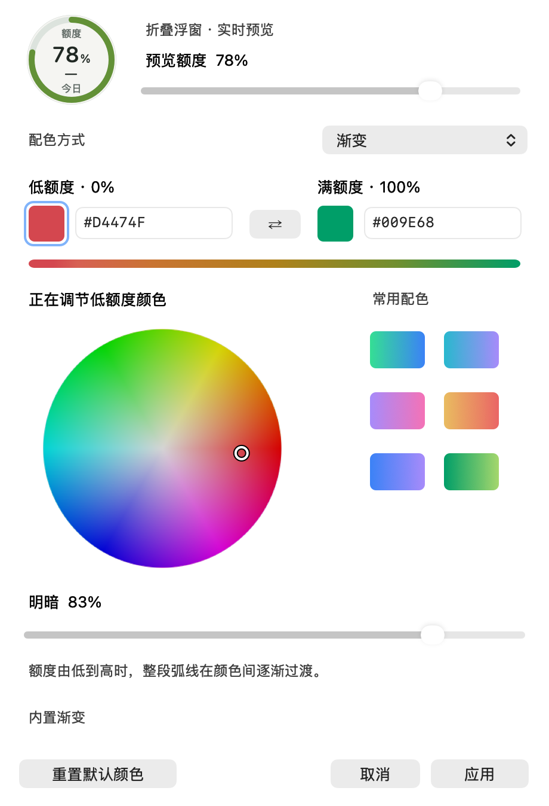
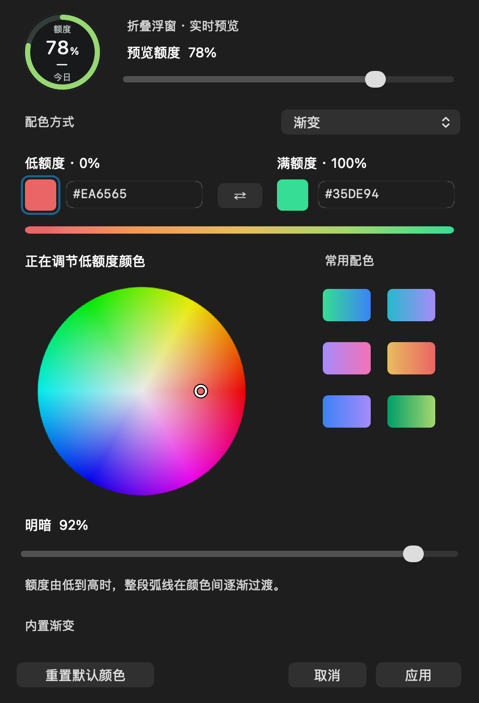

# 折叠浮窗弧线配色

macOS v1.0.3 支持自定义折叠浮窗的额度弧线，提供 Apple Silicon 与 Intel 安装包。

右键浮窗，选择 **弧线配色…**；也可以从 **设置 → 显示与浮窗 → 弧线配色…** 打开。多个入口复用同一个编辑窗口，重复打开不会丢失正在编辑的颜色。

- **单色**：整段弧线始终使用同一种颜色，默认取当前主题下的满额度颜色（浅色 `#009E68`，深色 `#35DE94`）。
- **渐变**：整段弧线的颜色随剩余额度变化。自定义方案由低额度（0%）与满额度（100%）两个颜色在 sRGB 通道间插值；不是沿同一条弧线同时显示不同颜色。
- **内置渐变**：沿用已有的主题配色及额度色阶。编辑任一端点或选择预设后，变为自定义双色方案。
- **重置默认颜色**：在单色模式恢复满额度默认色，在渐变模式恢复内置渐变；不会清除另一模式中尚保留的颜色。

调色板、颜色数值、预设与弧线预览都在同一个窗口内。点击颜色方块选择要调整的端点，再拖动色轮或明暗滑块，也可以输入六位 HEX 颜色。色轮支持方向键，Shift 加方向键可加大调整幅度。切换单色和渐变会保留各自的颜色。

修改会实时预览。窗口内的“预览额度”仅用于试色，不会改变实际额度或预算数据。**应用**成功后才保存，重新打开应用仍保留配色；**取消**、Escape 或关闭窗口都恢复已保存的颜色。保存失败时保留草稿和错误提示，可以重试。

本设置只影响折叠圆环，包括使用相同圆环的预算视图；不改变展开面板、电池填充、侧签、额度计算或提醒规则。Windows 和共享后端本次未改变。

## 原生界面

以下为 v1.0.3 当前 AppKit 界面的离屏渲染，使用 78% 演示额度，不读取用户数据。





## 开发验证

```sh
python3 -m unittest tests.macos.test_arc_colors -v
```

测试使用独立偏好域，覆盖内置色阶、自定义插值、单色默认值、重置与模式保留、保存与恢复、损坏配置保留、失败后重试、关闭撤销，以及真实浮窗绘制范围。额外设置 `CODEX_USAGE_ARC_PREVIEW_DIR` 可导出原生界面的离屏渲染；离屏图不等于桌面交互或发行包验收。

嵌入预览还会与独立折叠浮窗进行像素对比，覆盖深浅主题、0% / 9% / 79% / 100% 和不同窗口位置，防止百分比误用外层窗口坐标而偏移；预览组件不能改变调色窗口的阴影。

实现入口：[配色模型与圆环绘制](../../src/macos/Features/Floating/Capsule.swift)、[单窗口编辑器](../../src/macos/Features/Floating/ArcColorEditor.swift)、[宿主与生命周期](../../src/macos/App/Main.swift)。

[返回 macOS 文档](README.md)
