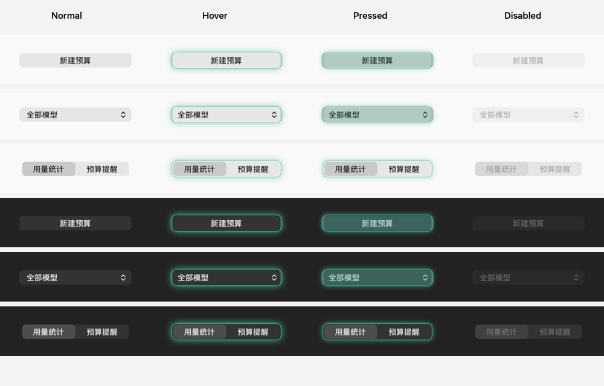
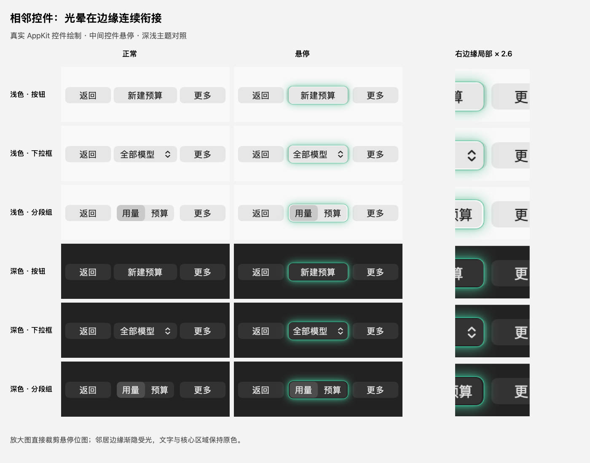
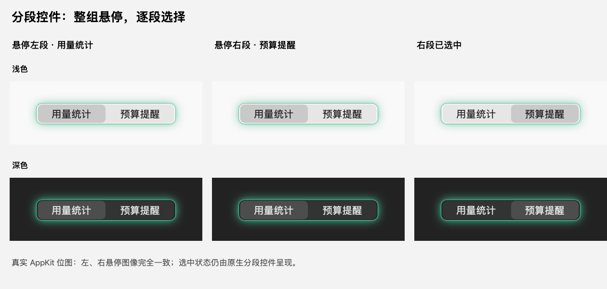
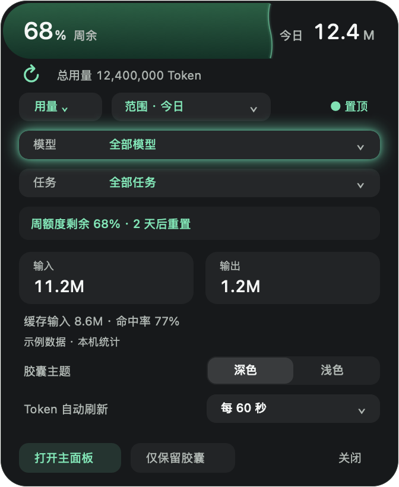
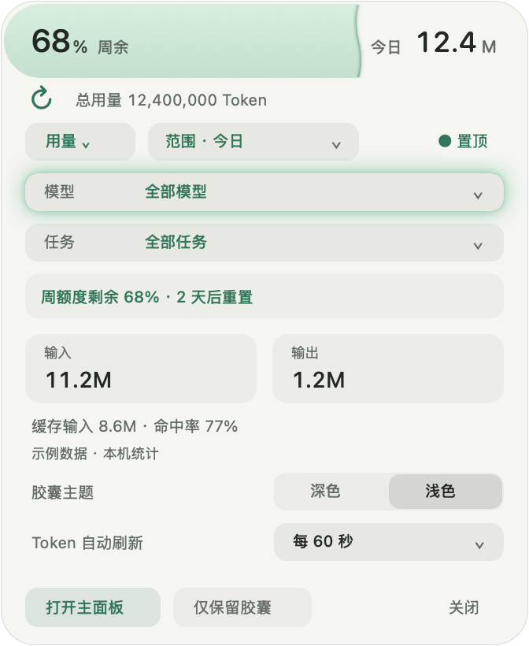

# 自定义预算与提醒

此功能随 macOS v1.0.2 发布。预算用于提醒使用节奏，不会阻止请求、终止任务、兑换重置卡或改变官方限额。所有提醒无声；系统通知是否即时显示仍受 macOS 通知权限和专注模式影响。

2026-09-14 当前源码已包含多预算草稿、恢复、按模型缺价诊断、实际官方窗口选择、本期／下期对照和显示浮窗独立回执；见[当前状态](../common/MACOS-ADAPTATION-BACKLOG.md)与[本轮验收](FEATURE-SYNC-VALIDATION.md)。

## 建立预算

在主面板左上方的常驻导航中选择「预算与提醒」，点击「新建预算」；选择「用量统计」可直接返回。两页共用一个主面板窗口，默认内容尺寸为 1100×780，最小为 1040×718。切页只替换内容，保留窗口尺寸、位置、筛选和未保存草稿；手动调整的窗口大小在下次打开时恢复。创建过程中选择：

| 口径 | 设置与计算 |
| --- | --- |
| Token | 总 Token、非缓存输入 + 输出，或仅输出；总量为输入加输出，缓存与推理不重复计入。可选择百万、千或原始 Token 单位，例如 20M 表示 2,000 万。 |
| 估算金额 | 按模型填写每百万 Token 的 USD 输入、缓存输入与输出单价；可用 USD，或手填固定 USD→CNY 汇率显示人民币。价格空白表示未知。 |
| 官方余量下限 | 选择固定官方额度窗口和剩余百分比下限；按账号快照判断，不按模型或任务拆分。 |

官方「期间消耗」模式暂不可启用：当前清洗后的接口不能可靠识别账号变化与所有额度重置，不能据此计算可信的百分比消耗。余量下限可正常使用；有官方重置时间时以该窗口的重置周期去重，缺少重置时间时按所设监测周期去重。

表单输入区和选择器宽度为 360 点。较长的模型、任务名称在选择器中截断显示，悬停可查看全文；选项按稳定 ID 保存，名称长度不会扩大窗口或改变统计范围。

周期支持每天、每周、每月、一次性起止时间和固定时长间隔。保存 IANA 时区，以 `[开始, 结束)` 查询精确时间戳。每月不存在的日期取月末，夏令时由当地日历处理。中途新建预算会计入当前周期内已发生的用量，不从点击保存时重新计数。最多 50 条预算，规则配置总量上限 64 KiB。

## 三个界面如何配合

| 界面 | 行为 |
| --- | --- |
| 主面板 | 左侧预算列表，右侧详情；在这里创建、编辑、停用、删除、暂停提醒及查看最近提醒。编辑草稿单独保存，未保存的草稿不参与监测。 |
| 菜单栏 | 保留原今日 Token 与官方余量标题；展开菜单展示前三项预算和管理入口。点击预算进入对应详情，不改变浮窗选择。 |
| 浮窗 | 保留收起 76×76、展开 336×410、5 点圆环；展开的内容选择器切换「用量 / 预算」。预算可自行选择，使用该规则的范围；点击周期进入主面板编辑。 |

主面板用量筛选、浮窗用量筛选和预算规则互不联动。切回用量模式恢复原筛选。选中的预算被停用、删除、到期或数据目录变化时显示明确状态，不自动换成另一项。浮窗左键打开主面板对应页面；右键菜单、悬停预览、拖动、保持展开、主题和 Token 刷新间隔沿用已有交互。

主面板关闭或 `⌘H` 隐藏时先确认草稿可恢复，随后释放自己的进程，菜单栏与浮窗的宿主继续监测。保存进行中或草稿写入失败时保留窗口。关闭浮窗只影响显示。明确退出整个工具才停止监测；再次启动会重新核对当前周期。

每个预算可保留独立草稿。切换预算后可通过“继续草稿”恢复原输入，原版本冲突时可“另存为新预算”；该操作仍需点击保存才创建新规则。“取消”放弃当前编辑，“保留草稿并返回”保留输入。保存／取消位于滚动表单之外。后台摘要更新不等于当前编辑已保存，保存回复有独立请求编号。

## 操作反馈

主面板按钮、页面切换、下拉选择器和浮窗按钮采用 C 方案的外发光：悬停时在按钮外缘向背景扩散较宽、较亮的青绿色柔光，按钮内部保持原色；按下时内部变色，光晕收紧。选中状态沿用原生控件，禁用按钮不高亮。鼠标离开、拖动取消、菜单结束、切页和收起时清理临时反馈。

同组互斥选项使用一个分段控件：主面板的时间范围、按模型／按任务和页面导航，以及浮窗的深色／浅色主题，悬停任一分段都会让整组外轮廓发光。跨分段移动时外轮廓保持一致，选中状态与点击动作仍属于各自选项。

不同控件靠近时，柔光显示在按钮背景上方，连续经过相邻控件的边缘，再向内平滑减弱，保护中央文字区域，避免光晕被矩形边界突然切断。发光范围只负责显示，不扩大按钮的点击或鼠标跟踪范围。主面板的光晕由临时、不可交互的小型视图绘制，移出后移除；浮窗复用原绘制表面。反馈由事件触发，不新增闲置动画、计时器或后台服务。

下图使用原生控件和固定演示文字，对比深浅主题的正常、悬停、按下与禁用状态：

相邻控件及边缘放大对照：

浮窗示例使用合成数据，展示鼠标停在「模型」选择器时，光晕与上下相邻控件的过渡：

  
  

以下是实际绘制结果的 3 倍放大图：左图悬停「深色」，右图悬停「浅色」；鼠标移动不会改变已选主题，两段共用同一个发光轮廓。

## 阈值、修改与数据状态

- 默认剩余 20%、10%、0%，可修改。每项预算每周期每级最多提醒一次；一次更新跨过多个级别只弹最严重一级，多项同时触发合成一条无声提示。
- 「暂停 30 分钟」「本周期不再弹出」只暂停主动提醒，统计和静态状态继续更新。「停用预算」停止该项判断，重新启用不会清空本期已用量。
- 主面板在前台、是关键窗口且正在显示对应预算详情时，以详情状态呈现，避免再弹同一条系统横幅。编辑、最小化、隐藏或其它页面不按已查看处理。
- 修改额度立即生效；修改周期、范围、币种或价格默认下期生效，可明确选择重算本期。详情在下期生效前仍标注本期有效范围。
- Token 自动刷新间隔控制 Token/金额更新。关闭后不自动扫描日志；手动刷新后判断。官方额度在启用账号查询时保持约 60 秒独立更新；“数据与更新”提供独立开关及重试。跨入新周期而索引还停留在上一周期时显示待更新，不虚构 100% 余额。
- 未落盘、缺失字段、价格未知和无法归属的记录不视为零。部分覆盖时通常显示剩余未知；仅已知消耗已达到或超出预算时仍可提示，注明实际用量可能更高。
- 更换 Codex 数据目录不会把新目录消耗套入旧预算。原预算保留绑定关系并提示目录变化，可回到原目录或另建规则。

## 存储与运行成本

`~/Library/Application Support/CodexUsageDashboard/desktop/budgets.json` 保存规则、当前摘要和有界提醒账本，以原子替换写入并限制文件权限。损坏配置保留原文件并提示错误；写入失败不会假装保存成功。编辑草稿保存于本机偏好，不进入规则文件。

损坏预算进入专用恢复页，确认后先完整备份原文件再重建。草稿使用本平台 v2 集合，兼容读取旧单草稿；损坏或超限的草稿不被静默覆盖，可在预算页备份后恢复。旧草稿键作为迁移依据保留。

只有宿主创建 `BudgetStore`、周期定时器和通知投递入口。Token/金额批量读取已经提交的 SQLite 索引，使用短时 `CodexSummary --budgets-file`；不启动另一个常驻服务，不额外扫描原始日志。多次刷新合并，过期请求按规则版本、周期与数据目录拒绝。主面板收到有界分块快照后一次应用，避免大规则列表被截断。

浮窗仍是原生绘制视图，收起时释放详情动作和临时菜单，保留少量摘要用于即时展开。没有闲置循环动画。此实现未以真实长期物理内存测量证明具体增量，也不承诺整个应用低于 10 MB。验证范围见 [验证记录](VALIDATION.md)。

## 当前编辑与回执

标题旁提供编辑和在浮窗显示；启停、暂停、复制和删除集中于更多菜单，删除单独确认。底部保存／取消、生效说明、立即重算和保存后显示选项保持可见。时区输入支持搜索补全；无法结束原生日期输入编辑时拒绝保存。

金额预算按模型列出输入、缓存输入和输出缺价；未知价格不当成零成本。进入补价时保留对应模型，补齐后显式重算。官方余量预算从账号实际窗口中选择，区分未读取、过期和窗口不存在，草稿不会被默默改成其他窗口。

规则保存和显示浮窗分别等待确认。保存成功但显示失败时明确告知，只重试显示，不重复保存预算。
