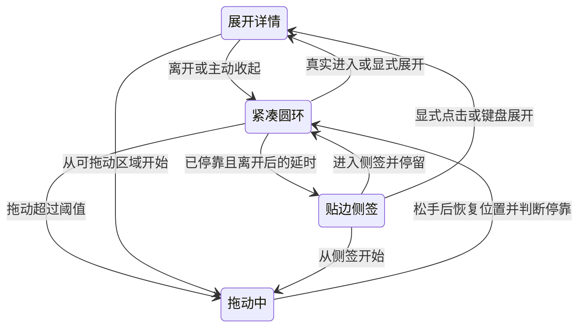

# macOS 特性同步设计方案（已批准，实施中）

日期：2026-09-14。源码基线：cf8bbed2d43526a9f6401d9e86de30bc12a56413＋当前工作区修改。

**用户在效果动画审阅后授权“全部开始实现并验证”，A–H 及本文预算补齐范围现已进入实施。** 批准不等于功能完成；每项实现和验收状态见 [剩余清单](../common/MACOS-ADAPTATION-BACKLOG.md)，此前已安装候选见 [安装验证](LOCAL-INSTALL-20260914.md)。新功能必须以当前源码、候选构建和相应验证证据逐项确认。

## 最新范围澄清

用户明确收起／吸附 UI 改善针对新增的监控状态标记。保留额度圆环，不再采用整体横向胶囊重设计。最新实现说明与效果动画见 [实施记录](FEATURE-SYNC-IMPLEMENTATION.md#收起态和贴边态设计修订按用户澄清纠正范围)。下文历史审批行为继续有效；其中状态图的圆环语义保持。

## 审批范围

建议一次确认下表 A–H 的行为和取舍，之后按批次实施已批准范围。表中的时间、尺寸和资源目标是本项目建议，不是 Apple 的强制规范；若实际验证需要改变用户可观察的行为，再说明变更。

| 编号 | Windows 参考 | 建议的 macOS 方案 | 用户可观察的差异 |
| --- | --- | --- | --- |
| A：监控与导航 | 主面板任务监控、独立提醒设置窗口；宿主定时驱动文件检查 | 常驻 Swift 宿主持有监控，目录事件触发增量读取；主窗口用量／预算／任务监控三页，提醒选项进入统一设置 | 关闭主窗口继续监控；监控不依赖统计 Python 启动成功；提醒设置不再多开一套独立窗口 |
| B：浮窗位置 | 物理像素＋DIP，默认左下，按空间翻转；极小工作区保留固定面板尺寸 | AppKit point 坐标；同样默认左下并按空间选择方向；极小可用区限制面板外框并让内容滚动 | 保留圆环锚点；屏幕边缘和小工作区仍能访问底部操作 |
| C：拖动范围 | 整个可见区域参与拖动，包括展开态 | 按用户后续要求，圆环、侧签和展开面板全部内容区域支持单击按住拖动；按钮保留未拖动时的单击，摘要双击进入选择，原生滚动条处理滚动 | 不把选择文字或操作控件误解释为移动窗口；超过 3 pt 的拖动取消原点击 |
| D：隐藏与唤回 | 侧签周围 8 DIP 近邻范围，停靠期间每 100 ms 检查指针 | 保留四边停靠；只用侧签实际可见区域的 NSTrackingArea＋可取消延时，进入后先恢复圆环 | 鼠标必须触及侧签；不设置不可见的邻近触发带，不周期读取鼠标位置 |
| E：形变实现 | 预留 HWND 范围、自绘形变及命中管理 | 保留单个非激活 NSPanel，原生窗口尺寸／位置过渡与一个视觉主体同步，增加状态版本和反向保护 | 延续圆环到面板的连续性；不照搬 Windows 大透明窗口。透明角、焦点和中间帧通过原型实测后才接入 |
| F：菜单栏 | 悬停自绘只读卡、点击详情、右键菜单、双击主面板 | 悬停保留简洁系统提示，单击 NSPopover 详情，右键分组菜单，保留双击主面板入口 | 悬停不出现另一张大卡；可复制／操作内容集中在单击弹层，Esc／外部点击只关闭弹层 |
| G：统一设置与外观 | 全局主题＋各界面覆盖；设置和提醒分窗口 | 单一原生设置窗口，Command–Comma；四页外观、显示与浮窗、数据与更新、提醒与恢复；可选界面覆盖 | 主面板不堆放常驻设置按钮；仅浮窗／仅菜单栏也能设置；菜单栏图标始终跟随系统对比度 |
| H：剩余刷新等待 | 不照搬 Windows 的周期宿主 tick | 为 macOS 主面板增加有界的后端版本／完成通知，保留请求身份、超时和失败恢复；取消用 1 秒／150 ms 心跳推断完成 | 正常更新和手动刷新仍及时；切预算／监控页后不需要用量页绘制来确认完成 |

**先呈现效果动画，再审批实施。** 方案审阅应使用可播放、暂停、慢放和拖动时间轴的交互演示，不能仅以文字或状态图代替。2026-09-14 已在当前设计讨论中提供 11 个演示场景，覆盖下表；这些是演示数据和模拟交互，不计为功能完成，也不代表用户已批准。

| 效果场景 | 审阅重点 |
| --- | --- |
| 四个位置自动展开 | 左右、上下翻转，展开和收起的锚点连续性 |
| 左、右、上、下四边隐藏与唤回（4 个场景） | 离开延时、可见侧签、先恢复圆环再真实移入展开，避免整条屏幕边缘触发 |
| 展开中途反向 | 从当前中间帧收起，不先跳到完整面板 |
| 展开态拖动 | 任意内容区单击抓取、自由跟随、松手保留展开并判断停靠 |
| 保持展开与主动收起 | 主动收起优先，静止指针不会立即重新打开 |
| 任务监控 | 选择任务、订阅、本轮结束后的未读、关闭主面板后继续监控，查看消息不自动标读 |
| 菜单栏与设置 | 悬停简洁提示、单击详情、可复制内容、统一设置及独立外观 |
| 预算诊断与后续操作 | 定位缺价、输入错误、预算保存成功但显示失败、只重试显示浮窗 |

演示提供浅色／深色和减少动态效果选项。播放时长用于审阅拟议时序，逐帧按钮以约 16.7 ms 移动时间轴，不代表原生 App 已达到 60 fps。多显示器、Dock／菜单栏实际占位、透明区域点击穿透、键盘焦点、系统通知、后台监测和功耗仍需获批后在原生实现中验证。B/C/D/E 批次首先把已审阅效果落实为原生原型，再验证中间帧和点击目标后接入完整功能。

## 1. 任务监控：保持 Windows 的业务语义

### 操作路径

主窗口固定三页：**用量｜预算｜任务监控**。监控页内分“监控中”“未读 N”“历史”；“选择任务…”打开可搜索、多选的原生 sheet。选择范围为“仅本轮”或“每轮”，提交按钮显示“开启 N 项提醒”。切换页面保留筛选、选中任务、预算草稿和主窗口位置。

任务卡显示名称、项目、轮次状态、最后确认时间、订阅策略和可执行动作。详情提供标识和项目，当前不承诺直接跳转 Codex 对应任务。主面板的模型／任务用量筛选不改变监控订阅。

| 动作／状态 | 约定 |
| --- | --- |
| 仅本轮 | 绑定明确 taskID＋turnID，提交前复核；已经结束或轮次改变的选择分别返回失败原因 |
| 每轮 | 保留当前任务订阅；结束后显示等待下一轮，不加入其他任务 |
| 取消监控 | 停止本工具订阅，保留消息，不停止 Codex |
| 查看消息／标为已读 | 只标记对应消息；打开列表或查看任务不整批标读 |
| 清除已结束结果 | 保留活动订阅和消息；与清理已读历史分开 |
| 暂停通知 | 继续记录、更新状态与未读标记，不发送横幅 |
| 常驻关注 | 只改变圆环／侧签的重点任务，不影响其他订阅 |

来源暂时不可靠时显示“状态待确认”及原因；正常结束称“本轮已结束”。等待审批、执行失败、完成百分比、剩余执行时间均不根据日志安静或 Token 推测。继承 Windows 默认：仅本轮、系统通知＋应用内标记、无声、已读历史保留 30 天；未读和有效监控不按普通已读历史清理。

### 事件与持久化

- Swift 宿主独占监控存储与状态转换，主窗口只接收版本化快照并发送有回执的操作；不增加常驻 Python 监控进程。可沿现有跨进程通信扩展，快照有大小上限，较大消息列表按页读取。
- 共享一个目录事件分发器，向用量采集和监控分发路径／标志。任务读取自己的追加字节及生命周期字段，保留有界尾部／回溯预算，半行、超长行、轮换、截断、归档和文件身份变化均有明确处理。
- 不保存提示词、回复正文或文件内容；仅持久化任务／轮次标识、显示名称、订阅、消息、去重键、文件身份与游标。路径比较遵守实际文件系统语义，不复制 Windows 的统一忽略大小写规则。
- 启动、唤醒、根目录变动、事件丢失、手动“检查任务”时补查。事件丢失要求递归核对受影响目录；分批限额执行，在完成前显示核对中，不能只重新检查已订阅文件就宣称恢复完整。
- 正常静止时不做每秒任务全扫描。初始建议事件合并窗口约 250 ms；仅在有活动订阅时每 60 秒做一次有界元数据校验，设置容差；监听失败采用退避补查并显示降级状态。具体频率根据事件延迟和功耗实测调整。
- 元数据创建时间不作为首轮开始事件的先后门槛，保留 PR #12 的秒／毫秒兼容；旧结束事件不得覆盖新轮次，旧不一致检查点需重新核对。
- 原子写入监控文件；写入失败保留操作意图并明确尚未可靠保存。损坏原件先备份，再允许恢复。重启后的离线结束只补入消息，不逐条补弹系统通知。

Apple 建议采用文件事件减少定时轮询；FSEvents 的丢失／合并标志要求相应重扫，因此“事件驱动”仍需恢复机制。[节能指南](https://developer.apple.com/library/archive/documentation/Performance/Conceptual/power_efficiency_guidelines_osx/Timers.html)、[FSEvents 丢失处理](https://developer.apple.com/documentation/coreservices/kfseventstreameventflaguserdropped)。这些资料支持机制选择，不提供本工具的省电百分比。

### 预算与任务共用通知入口

当前 BudgetCoordinator.start 独占 UNUserNotificationCenter.delegate，并只注册 budget 类别。新增宿主通知路由器统一注册类别、按 messageID／ruleID 分发，避免任务模块覆盖预算通知。

首次选择系统任务提醒时，在相关操作中请求通知权限；已有预算授权则复用实际授权状态。拒绝权限后继续应用内标记，设置页解释当前状态；不反复弹授权请求。系统通知只含名称和状态摘要，可隐藏名称，声音默认关闭。

“查看”打开对应消息；“标为已读”可后台完成，不强制打开主面板。冷启动先恢复存储再路由，重复回调幂等；预算编辑中的跳转继续保留草稿。遵从系统通知与专注模式，不额外申请读取专注状态，不以自绘弹窗绕过静默。提交成功、投递失败、已读是不同状态，不声称系统横幅已被用户看见。[Apple 权限时机](https://developer.apple.com/documentation/usernotifications/asking-permission-to-use-notifications)、[通知动作处理](https://developer.apple.com/documentation/usernotifications/handling-notifications-and-notification-related-actions)。

## 2. 浮窗：方向、拖动与四边状态

**后续澄清优先：** 保留 76×76 pt 额度圆环；监控标记放在环内，不遮挡弧线。左右使用 36×76 pt 竖签，上下使用 80×32 pt 横签。136×44 胶囊方案已撤回，不是当前规格。

### 几何规则

圆环仍以 76×76 pt 为基准，详情以现有 336×410 pt 为常规尺寸。展开时读取所在屏幕当前 visibleFrame，给详情尽量保留 12 pt 边距；坐标直接使用 AppKit 屏幕坐标，不对全局位置再乘 Retina 比例。

先判断默认左下是否放得下，再分别翻转水平／垂直方向。以下是常见位置的示意，实际依据剩余空间，不是简单按屏幕四等分：

| 圆环位置 | 常见展开方向 |
| --- | --- |
| 右上 | 左下 |
| 左上 | 右下 |
| 右下 | 左上 |
| 左下 | 右上 |

本次展开期间及拖动松手后保留方向，避免跳边；下次重新展开或屏幕变化时再判断。收起回到同一个紧凑锚点。可用区比面板小时，缩小外框、内容滚动、固定主要操作，不把不可见按钮留在屏外。

多屏以拖动指针所在屏幕优先，恢复时用窗口交叠面积和保存屏幕标识判断。停靠位置保存“屏幕关联＋边＋沿边相对位置＋自由状态备份”，拔屏时转移到可用屏幕并夹取范围。旧 capsuleOrigin 只做一次迁移。初版排除屏幕接缝，已由下述 2026-09-15 确认修订取代。旧主窗口 autosave 布局也需要迁移，不能只读新键。

菜单栏、Dock 和刘海由 visibleFrame 限制；不把侧签放进系统预留区域。每次关键定位都重新取可用区，监听显示器、Space、休眠恢复等通知。macOS 12+ 的 safeAreaInsets 等 API 必须有 availability 保护，保留 macOS 11 构建目标。Apple 明确说明 visibleFrame 排除菜单栏／Dock，并要求不要缓存其矩形。[NSScreen.visibleFrame](https://developer.apple.com/documentation/appkit/nsscreen/visibleframe)。

### 拖动与隐藏

- 拖动期间不强行吸边，保持抓取点相对窗口的位置；超过 3 pt 后取消原点击，释放后才处理越界与吸附。
- 距可用区边缘 16 pt 内松手可停靠。四边均支持；2026-09-15 用户明确选择“与外边缘一致：贴合并自动收成侧签”，取代初版接缝不隐藏的规则。这是已确认的 macOS / Windows 行为差异。拖动经过接缝不吸住；只在松手后按指针所在屏幕贴合，侧签完全位于归属屏幕的可用区内。展开态松手仍保持展开，正常移出并收起后进入相同的延迟隐藏流程；保持展开、菜单及键盘保护继续生效。重启或屏幕布局变化不能仅因边缘连接另一块屏幕就清除停靠。
- 自动隐藏默认可用，但升级时不立刻隐藏旧位置的浮窗；用户拖到边缘或明确选择停靠后进入该状态。提供“靠边自动隐藏”开关，关闭后恢复圆环。
- 菜单打开、拖动、键盘操作、保持展开时暂停隐藏。主动收起优先于保持展开；指针真正离开后再进入才允许自动展开。
- 保留 Windows 的两阶段意图：详情收回圆环，圆环离开后等待约 550 ms 再变侧签；指针进入可见侧签停留约 120 ms，先恢复圆环，继续真实移动进入圆环才展开。点击侧签直接显示详情，保证键盘和点击也可达。
- 初始过渡目标可参考展开／收起 280／220 ms、侧签隐藏／恢复 220／160 ms，最终以原型和原生实测为准。系统减少动态效果时取消形变，保留必要防误触等待。[减少动态效果](https://developer.apple.com/documentation/appkit/nsworkspace/accessibilitydisplayshouldreducemotion)。

建议侧签只在可见范围处理进入／离开事件，省去 Windows 的 8 DIP 邻近触发带和每 100 ms 检查。局部 NSTrackingArea 可在应用不活跃时接收跟踪事件；离开时取消一次性延时，动画结束停止绘制。无需全屏透明触发窗或辅助功能授权。[NSTrackingArea 选项](https://developer.apple.com/documentation/appkit/nstrackingarea/options-swift.struct/activealways)。

状态转换示意（不是已实现动画）：

### 内容与无障碍

展开后保留电池式额度摘要，提供用量／预算／监控内容选择；底部只放“打开主面板”“收起”。置顶、常驻方式、主题、隐藏和退出放到清楚分组的更多菜单。

额度侧签可选显示剩余或已用，未知为“—”、过期有文字／符号提示；警示色依据剩余额度。任务执行状态用独立小符号，未读数单独统计，不把任务进度画成额度百分比。真实已用超过 100% 的数字属于两端共同新增语义，本批先保持 Windows 现有上限并在详情显示超支金额／用量。

Tab／Shift+Tab 遍历动作，Enter／空格与鼠标共用命令；Esc 先关闭菜单，再收起详情；键盘焦点存在时不自动藏为侧签。显式打开主面板／设置才转交前台，悬停不抢焦点。

## 3. 预算诊断与保存闭环

保留当前 Swift 预算规则、原生日期控件、按预算草稿和单写入宿主；补齐交互及诊断，不修改 Token 解析口径。

1. 详情标题附近放编辑／在浮窗查看；暂停／恢复靠近提醒状态；启停、复制、删除放更多，删除确认。固定保存区显示错误摘要和本次生效范围。
2. 下期规则可展开与本期逐项对照，包括统计口径、范围、时区、窗口和价格。当前额度继续取实际生效摘要，避免把新规则的单位套在旧结果旁。
3. 缺价状态列出模型和缺失类别，区分价格缺失、缓存分类不明、用量不完整；已知金额只作为下界。修复入口预填缺价模型，用户输入价格后决定立即重算或下期生效，不自动网络查价。
4. 额度窗口从当前账号快照生成；区分未读取、过期、窗口不存在和不支持的条件。保留原草稿与旧选择的解释，不能悄悄换成另一个窗口。
5. 日期保存先检查编辑是否成功结束，再验证日历时间和时区；被拒绝的输入继续保留并就地报错。当前 save() 忽略 makeFirstResponder(nil) 的 Bool，可能在提交被拒绝后继续读取旧 dateValue；这是已定位的防护缺口，仍需真实输入复现。Apple 说明当前编辑器拒绝退出时该调用返回 false。[makeFirstResponder](https://developer.apple.com/documentation/appkit/nswindow/makefirstresponder(_:))。
6. 保存规则与显示浮窗分别返回 requestID 结果。先显示“预算已保存”，后续失败则显示“浮窗未打开，可重试显示”；只重试后续动作，避免重复保存。现有冲突另存、停用状态和多草稿能力保持。

## 4. 统一设置和菜单栏

设置窗口由宿主按需创建，关闭后释放不需要的视图。App 菜单提供“设置…”和 Command–Comma，浮窗更多／菜单栏右键进入同一窗口；记住上次页面，按明确的来源命令定位到相应页。设置入口不因主窗口停在预算页而不可达。Apple 建议把常规设置放入 App 菜单和分组设置窗口，恢复上次页面。[Apple Settings HIG](https://developer.apple.com/design/human-interface-guidelines/settings)。

外观默认跟随系统，可选择全局浅／深；高级区域允许主面板、浮窗、菜单栏详情独立覆盖。迁移现有 capsuleTheme 时保留原显式选择，使用“继承全局”才取消覆盖。菜单栏图标使用系统 template 对比度，不单独强制深色图标。系统高对比度、减少透明度和减少动态效果优先。

菜单栏左键详情采用 NSPopover，展示当前快照、数据更新时间、额度、监控摘要和未读；可选数字复制，支持打开主面板、检查／刷新和设置。只读取已发布状态，悬停和打开详情不发起新的日志扫描。右键保留完整命令菜单，双击保留主面板入口；单／双击仲裁不得重复执行动作。原生 popover 提供锚定和关闭行为，仍需验证失焦、Esc、菜单打开后的焦点交接。[NSPopover](https://developer.apple.com/documentation/appkit/nspopover)。

## 5. 继续减少空闲工作

已完成的后端父进程／HTTP／刷新等待不重做；新增任务和侧签也不直接复制 Windows 周期 tick。

对仍存在的主面板健康轮询，建议在 macOS 启动协议中增加版本化、长度有上限的单向事件流：报告索引版本、刷新 ticket 完成和错误，日志输出与事件通道分离。可用子进程 Pipe 承载事件，Swift 通过可读事件接收；不把每条 Token 日志都向 UI 推送。默认未启用时保留现有 Windows 协议。

收到完成事件后仍通过当前快照身份读取结果；断线、启动握手、进程退出及请求超时分别处理。主窗口不可见或在预算／监控页时释放无需显示的用量数据；不等待用量页绘制才确认刷新。通知通道异常时可退避检查并明确降级，不通过永久高频监督维持看似正常的状态。

没有本工具整机功耗对照之前，不给出省电比例。验收记录实际 CPU 时间、唤醒、读盘字节、文件描述符、子进程数和 physical footprint；有正常刷新期限的工作不能算作“无意义轮询”。

## 6. 开源参考与取舍

2026-09-14 已阅读下列项目实际源码，链接固定到核对时提交。只借鉴与当前问题有关的算法和职责，不因为项目知名就引入整套依赖。

| 参考 | 可借鉴的具体做法 | 本项目取舍 |
| --- | --- | --- |
| [Rectangle / ScreenDetection.swift](https://github.com/rxhanson/Rectangle/blob/f7a4d91287aa688bf79b003e40ba7dc275f0bdf2/Rectangle/ScreenDetection.swift) | 根据指针、窗口与屏幕交叠面积确定屏幕；区分显示范围与可用区 | 使用本工具自身窗口的几何；其部分 Dock 纠偏查询辅助功能树，当前不照搬，不新增控制其他应用的权限需求。实际 Dock 可用区异常单独复现处理 |
| [Maccy / SlideoutController.swift](https://github.com/p0deje/Maccy/blob/c376789c5d377b7c520b6f6e91f3f3a1aa28640b/Maccy/Observables/SlideoutController.swift) | 展开空间判断、动画开始锚点、完成回调检查预期状态、可取消自动展开任务 | 沿用这些防竞态思路；Maccy 的 screen.frame 判断不直接作为本工具 Dock／菜单栏避让规则，改用 visibleFrame；不因此提高 macOS 11 最低目标 |
| [Settings / SettingsWindowController.swift](https://github.com/sindresorhus/Settings/blob/f41475771f65379ca10852c95119a7f53f0de5a5/Sources/Settings/SettingsWindowController.swift) | 单设置窗口、按页导航、恢复上次页及窗口位置、显式激活前台 | 用现有 AppKit 构建等价的小型控制器，暂不新增包管理／运行时依赖 |

上述代码没有提供本产品完整的“四边额度侧签＋任务监控”现成模块。它们是局部设计依据，最终行为必须由本仓原生测试和安装版验证。

## 7. 实施批次与验收门槛

| 批次 | 范围 | 完成证据 |
| --- | --- | --- |
| 1 | A：任务事件模型、持久化、通知路由、主面板第三页和三种入口摘要 | 共用事件样本；首轮、长任务、重复／乱序、离线恢复、目录切换、取消／已读分别测试；安装版关闭主窗口后仍监控 |
| 2 | B/C：四方向定位、屏幕恢复、拖动；E 的形变原型 | 四方向和小可用区、中途反向、按钮点击／文本选择不误拖、负坐标／缩放几何；原生桌面中间帧与命中实测 |
| 3 | D/E：四边侧签、分阶段唤回、主动收起、键盘与减少动态效果 | 停靠静止无 100 ms 鼠标检查；菜单／拖动／键盘不被隐藏；静止指针不循环展开；实际可用设备的 Dock／多屏验证 |
| 4 | B02–B08 剩余预算行为 | 错误日期真实输入、缺价模型定位、真实窗口缺失／过期、保存成功后浮窗失败只重试显示、跨页多草稿 |
| 5 | F/G：菜单栏详情、统一设置、主题继承和窄窗布局 | 三入口同一设置；系统／浅／深、长文字、屏幕阅读、单／双击／右键、Esc 与焦点、旧偏好迁移 |
| 6 | H、E03–E05：完成通知、旧布局迁移、版本展示、资源与整体验收 | 事件通道断开／旧版本回退、退出无孤儿、稳定资源测量、两架构编译、最终本机替换安装与源码／二进制哈希对应 |

每批实现后同步剩余清单与使用文档，并记录失败路径和未验证范围。Windows 原生测试必须在 Windows 验证；Intel 交叉编译不能证明 Intel 实机；合成多屏几何不能替代实际外接屏、Spaces 和休眠恢复；通知 API 成功不能替代横幅、通知中心点击和冷启动验收。

共同后续事项另列：选择器内部搜索、刷新保留明细选中／滚动、按原因恢复的空态、真正超过 100% 的已用侧签。等待审批／执行失败状态和官方期间消耗预算须先有可靠数据源，本方案不通过推测补齐。
