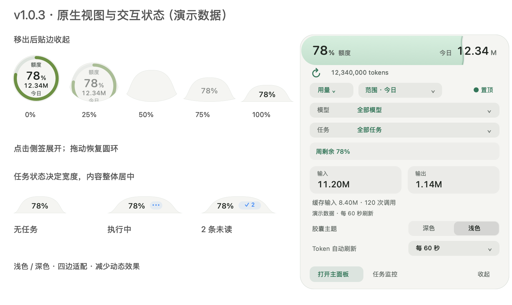
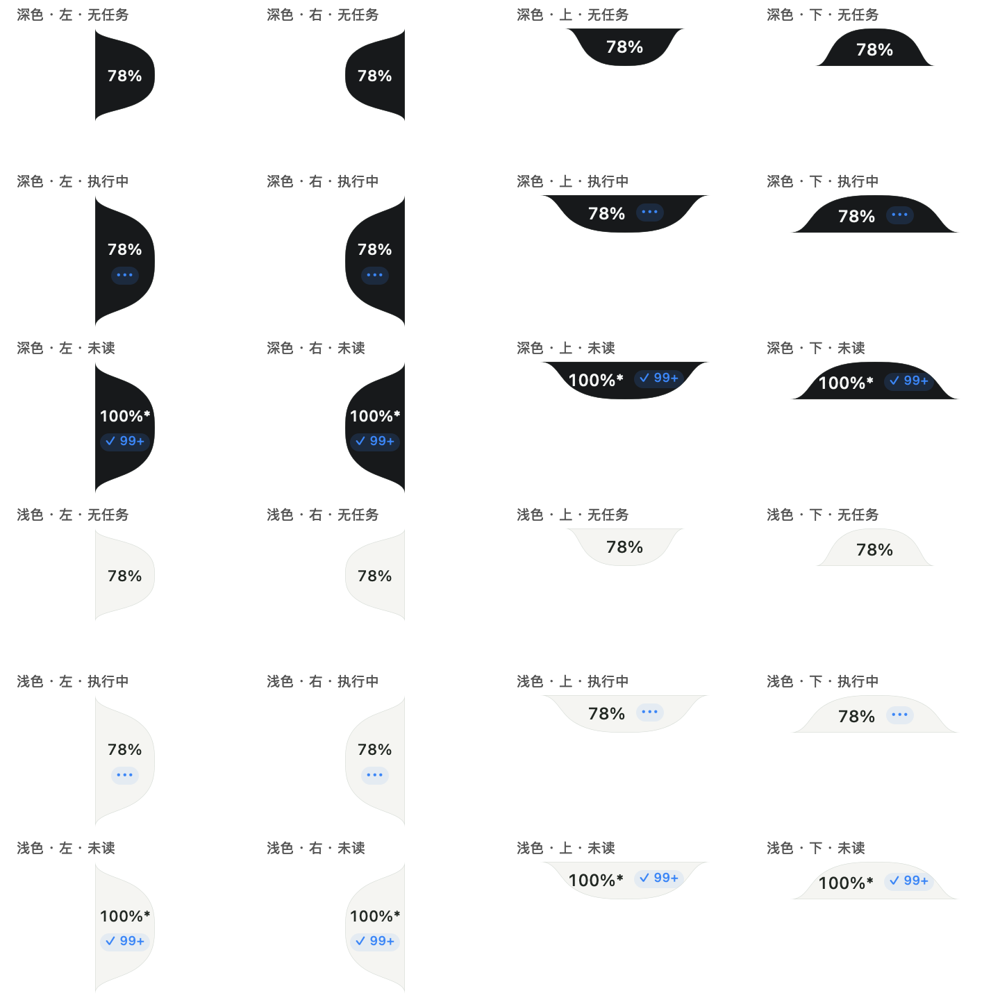

# v1.0.3 浮窗视图与交互

本页图片由当前 Swift / AppKit 源码直接离屏绘制，使用固定演示额度和任务状态，不读取真实账号、任务标题或用量。图片证明视图布局，不代替桌面输入与发行包验证。

## 圆环、展开与贴边



上排 0%—100% 是圆环到侧签的形变进度，圆环中的 78% 才是演示额度。贴边采用 D「微弧融合」：低矮微弧主体，两端平滑接入屏幕可用区域边缘。上、下、左、右使用同一轮廓旋转或镜像，数字始终正向。

| 操作 / 状态 | 结果 |
| --- | --- |
| 靠近边缘松手，再移出 | 延迟收起为侧签；持续拖动不被边缘吸住 |
| 悬停侧签 | 先恢复圆环，继续真实移入后展开详情 |
| 点击侧签 | 展开详情 |
| 拖动侧签或详情 | 移动整个浮窗，取消该次点击 |
| 无活跃监控且无未读 | 只显示居中的额度；不留图标空位 |
| 执行中、等待下一轮、待确认或存在未读 | 扩展尺寸，额度与状态整体居中 |
| 单轮任务结束并已读 | 无其他活跃监控时缩回紧凑尺寸 |
| 连续监控 | 等待下一轮时继续保留状态 |
| 减少动态效果 | 直接切换几何，保留防误触等待 |

尺寸变化保持沿边中心位置，屏幕边角空间不足时限制在归属屏幕可用区域内。透明边角不触发浮窗操作，绘制与鼠标命中共享轮廓。侧签设置可切换显示剩余或已用额度；过期快照保留 `*` 标记，未知额度显示 `—`。

## 四边与任务状态



图中还覆盖 `100%*` 与 `99+` 未读计数，避免只用两位百分比验证布局。

## 调色交互

见 [单窗口弧线调色板](ARC-COLORS.md)，包含色轮、HEX 输入、预设、单色、随额度渐变、默认重置及应用 / 撤销语义。

## 重现图片

```sh
python3 -m tools.macos.render_release_views --output build/previews/macos/v1.0.3
```

工具只创建离屏视图，不打开安装版、不保存用户偏好；需 macOS 与 Apple Command Line Tools。发布图片位于 `docs/macos/images/v1.0.3-*.png`。

[发行说明](RELEASE-1.0.3.md) · [返回 macOS 文档](README.md)
