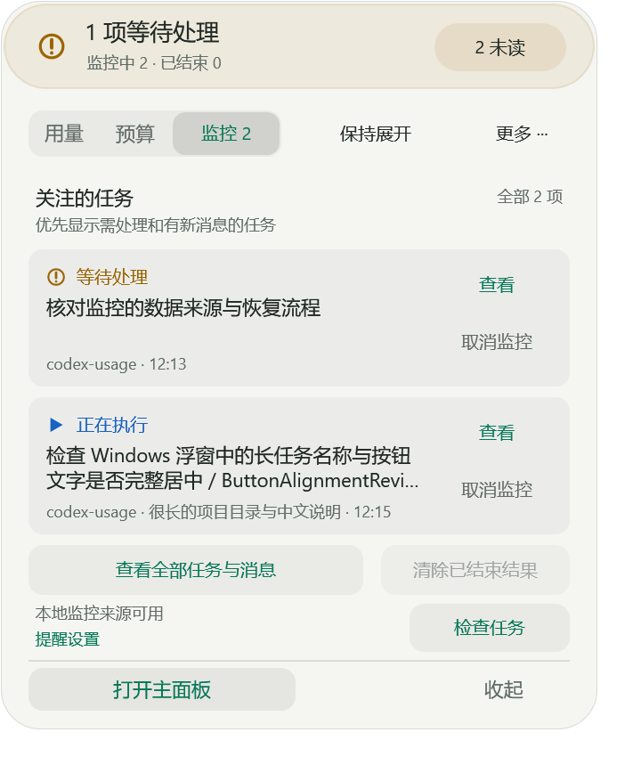
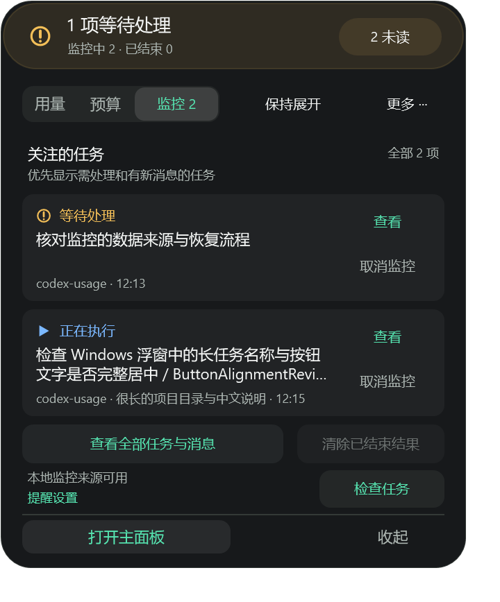

# Windows 使用与开发

[文档导航](../README.md) · [任务监控](TASK-MONITOR.md) · [预算管理](BUDGETS.md) · [验证范围](VALIDATION.md) · [界面设计](LAYOUT-PROPOSAL.md)

Windows v1.0.3 提供用量统计、预算提醒和任务监控，支持主面板、系统托盘与可拖动浮窗。Windows 使用 WPF 原生界面，与 macOS 共用统计后端；同名 [v1.0.3 Release](https://github.com/Asher-XunZhang/codex-usage/releases/tag/v1.0.3) 提供 Windows x64 及 macOS 两种芯片的包。v1.0.3 标签保留 macOS 首发源码，Windows 源码提交由发行页单独记录，ZIP 的 `source/` 与 `BUILD-MANIFEST.json` 可核对对应源码。两端能力差异见[对齐清单](../common/WINDOWS-MACOS-ALIGNMENT.md)。

## 界面示例

v1.0.3 新增弧线配色、微弧侧签与未读数量、账号额度开关、通知关联消息和通知内暂停。[本轮对齐决策](MACOS-PARITY-DECISIONS.md)记录 Windows 官方 API 依据与保留差异。

以下是使用合成任务和用量生成的监控浮窗浅、深主题快照，用于说明信息分组与状态样式，不含真实任务数据。快照不作为最终发行包或通知行为的验收凭据，具体能力与验证边界见[验证范围](VALIDATION.md)。

| 浅色主题 | 深色主题 |
| --- | --- |
|  |  |

## 下载与启动

从 [v1.0.3 发布页](https://github.com/Asher-XunZhang/codex-usage/releases/tag/v1.0.3)下载 `codex-usage-desktop-v1.0.3-windows-x64.zip`，完整解压到有写入权限的目录，双击 `CodexUsage.exe`。保留同目录的 DLL、`python/` 和 `backend/`；不能只复制 EXE。

应用自带 .NET 与 Python，不需要另外安装运行时或管理员权限。发行包未作 Authenticode 签名，Windows 的来源检查和组织策略仍适用；发布页的 SHA-256 用于核对下载完整性。

原生验证环境为 Windows 11 x64。运行时兼容范围以 [.NET 10 支持清单](https://github.com/dotnet/core/blob/main/release-notes/10.0/supported-os.md)为准；未提供 Windows ARM64 独立包，也未声称所有 Windows 版本均通过实机验收。

默认读取 `CODEX_HOME`，未设置时读取 `%USERPROFILE%\.codex`，可在设置中更换日志目录。账号额度通过本机已登录的 Codex 查询。未安装、未登录或查询失败时额度显示未知，本地用量仍可单独统计。

更新时先退出本工具，再将新包完整解压到原目录。设置和监控记录独立保存，正常替换程序文件不会清空它们。

## 常驻方式与窗口

| 操作 | 后果 |
| --- | --- |
| 关闭主面板 | 释放主面板及对应统计服务；保留托盘、浮窗和后台监控 |
| 仅系统托盘 / 仅悬浮窗 / 两者 | 改变常驻入口，不关闭已有主面板 |
| 隐藏至托盘 | 隐藏浮窗，并确保仍有托盘入口 |
| 收起 | 浮窗变回圆环，不停止统计或监控 |
| 保持展开 | 鼠标离开时仍显示面板；主动收起仍优先 |
| 窗口置顶 | 控制浮窗是否位于其他窗口之上，与保持展开独立 |
| 退出 Codex 用量 | 结束本工具及其后台工作，Codex 本身继续执行 |

置顶、贴边隐藏等设置在浮窗“更多 → 窗口行为”中。主题支持跟随系统、浅色和深色；主面板、浮窗、托盘可共用全局主题，也可分别覆盖。

托盘悬停显示短暂只读摘要，离开即关闭；单击打开可操作的详情卡，双击打开主面板，右键打开菜单。详情卡可复制数字、刷新或进入设置；Esc、点击外部及“关闭详情”只关闭该卡。

## 浮窗与拖动

圆环悬停后展开。立即按住可拖动圆环；展开尚未完成时，抓住可见部分也能接管为圆环拖动。

完整展开后，文字、按钮、禁用控件和空白区域均可作为拖动起点。移动达到 3 DIP 后只移动窗口，不执行按钮；未达到阈值且松手仍在原按钮上才按点击处理。轮廓之外的透明区域不拦截鼠标。

拖动时可超出屏幕，松手后越界面板平滑回到可见范围，内部位置不会强制吸边。启用贴边隐藏后，可贴到显示器工作区四边，包括相邻屏幕接缝；以松手指针所在屏幕为归属。下次展开按当前位置选择向左或向右、向上或向下，不固定使用上次方向。

贴边后鼠标离开会隐藏为微弧侧签，显示剩余或已用比例，未知时显示“—”。无活跃监控且没有未读时额度居中；有监控或未读时自动扩展，显示独立状态符号和未读数，超过 99 显示 `99+`。停留在侧签附近先唤回圆环，继续移入圆环才展开。菜单、拖动或保持展开期间暂停自动隐藏；关闭系统动画时直接显示终态。

浮窗右键菜单或“设置 → 显示与提醒 → 弧线配色”打开同一个调色窗口。可选单色、随剩余额度变化的双色渐变或内置色阶，支持色轮、HEX、预设和重置。修改实时预览，“应用”成功后保存；取消、Escape 或关闭撤销草稿，保存失败保留输入供重试。仅改变折叠额度圆环，不影响侧签、预算计算或提醒阈值。

## 用量与数据更新

账号额度不受本地时间、模型或任务筛选影响。用量浮窗顶部的周余与今日 Token 同样不随下方本地范围改变。

时间、模型和任务共同决定指标、趋势与明细范围。搜索只过滤明细表；导出默认使用当前显示行，包含搜索和排序，也可选择当前范围全部行。读取失败时不能把旧范围当作新结果，导出等待有效快照。

手动刷新请求本地日志与账号额度，分别显示成功时间和错误。本地自动更新只控制日志扫描；账号额度约每 60 秒读取，可单独重试失败来源。任务监控独立运行，暂停用量自动更新不会停止任务提醒。

“设置 → 数据与更新 → 读取账号额度”可单独关闭或重新开启查询。关闭后保留上次快照，旧请求的迟到结果不覆盖新状态，本地统计继续更新；重新开启会请求新额度。使用 `--no-quota` 启动的隔离运行始终不查询账号，该次运行不能从设置启用。

主面板通过后端事件接收扫描状态与刷新完成回执，通过宿主推送接收账号、预算、监控和设置变化。正常运行不再每秒轮询状态，连接异常才退避重试；关闭窗口仍释放其统计服务。

统计口径见[统计架构](../macos/ARCHITECTURE.md)，独立提醒操作见[预算管理](BUDGETS.md)和[任务监控](TASK-MONITOR.md)。

## 数据位置与恢复

应用数据保存在 `%LOCALAPPDATA%\CodexUsageDashboard\desktop`：

| 内容 | 文件 |
| --- | --- |
| 显示、主题、筛选与预算草稿 | `settings.json` |
| 预算规则与提醒状态 | `budgets.json` |
| 监控订阅、设置与消息 | `task-monitor.json` |
| 账号额度快照 | `quota.json` |
| 可重建统计索引 | `index-*.sqlite` |

`CODEX_USAGE_DESKTOP_BASE` 可指定隔离目录。更换日志来源不会将原预算自动转移到新目录。配置损坏时保留原文件并提供备份恢复；关闭时若草稿或必要设置未保存，窗口会保留并说明重试原因。

卸载时先退出，再删除解压目录。数据目录独立保留；只有希望清除偏好、预算和消息历史时才删除它。不要把整个数据目录或 Codex 授权文件提交到公开问题报告。

## 快捷键

| 快捷键 | 操作 |
| --- | --- |
| Ctrl+Q | 退出本工具 |
| Ctrl+H / Ctrl+W | 关闭主面板 |
| Ctrl+R | 刷新 |
| Ctrl+E | 导出 CSV |
| Ctrl+, | 打开设置 |
| Ctrl+S | 重试保存设置 |
| 浮窗 Tab / Shift+Tab | 在可用操作之间移动 |
| 浮窗 Enter / 空格 | 执行当前操作 |
| 浮窗 Ctrl+Space | 切换保持展开 |

## 构建与验证

构建需要 Python 3.10+ 和 .NET SDK **10.0.401**。首次运行下载固定版本运行时并还原依赖。在仓库根目录执行；发行包内重建时先进入 `source/`：

```powershell
python -B -m tools.windows.build
$env:CODEX_USAGE_WINDOWS_EXE = (Resolve-Path 'build/windows/x64/CodexUsage.exe').Path
& 'build/windows/x64/python/python.exe' -E -s -B test.py
python -B -m tools.windows.test_lifecycle --app build/windows/x64/CodexUsage.exe --output build/reports/windows/lifecycle.json
python -B -m tools.windows.test_monitor --app build/windows/x64/CodexUsage.exe --output build/reports/windows/monitor.json
python -B -m tools.windows.package
python -B -m tools.windows.verify_release --report build/reports/windows/verification.json
```

`tools.windows.build --dotnet <SDK中的dotnet.exe>` 可指定 SDK；省略时查找仓库 `.local/dotnet/dotnet.exe` 和 PATH。输出位于 `build/windows/x64/`，包和校验文件位于 `dist/windows/`。

随包 Python 为 CPython 3.14.7 embedded amd64，下载地址、大小与 SHA-256 固定在 `resources/windows/runtimes/manifest.json`。`BUILD-MANIFEST.json` 记录源码和发行文件哈希；源码变化后须重新构建，不能混用新源码与旧后端。

完整验证可能创建窗口并获取焦点。后台验证使用 `tools.windows.verify_release --background` 和 `tools.windows.test_lifecycle --background`；跳过的原生弹出层和焦点检查不能计为通过。`--skip-smoke` 仅检查结构与哈希，不执行应用。

`CodexUsage.exe --demo` 使用隔离合成数据预览，不读取真实日志或账号。具体测试入口和限制见[验证范围](VALIDATION.md)。
