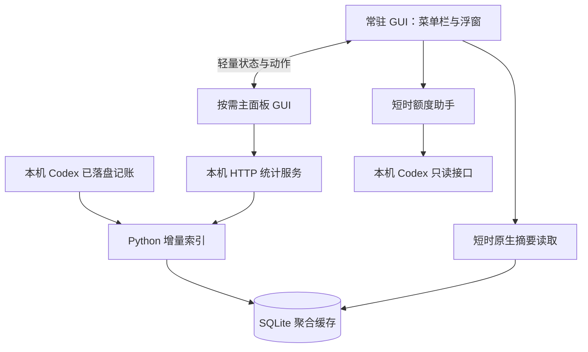

# 架构与进程设计

v1.0.1 采用稳定常驻 GUI 加按需独立主面板的设计：菜单栏和浮窗共用宿主，主面板单独运行；关闭主面板即可释放其进程内缓存，同时保持菜单栏与浮窗连续运行。

## 数据如何到达界面

统计服务只监听本机 loopback；界面仍是原生窗口，用户无需打开浏览器。Token 统计来自聚合索引，账户额度由独立的短时助手读取，二者口径不同。

## 三种显示状态有几个进程

| 状态 | 稳定时的进程 |
| --- | --- |
| 仅菜单栏 | 1 个常驻 GUI，没有闲置常驻 Python |
| 仅浮窗，或菜单栏与浮窗同时显示 | 共用 1 个常驻 GUI，没有闲置常驻 Python |
| 主面板打开 | 2 个 GUI，加 1 个 Python 统计服务 |
| 扫描、读取摘要或查询额度 | 可能额外出现短时进程，完成后退出 |

不能仅按窗口数量推算进程数量，也不能把一次采样看到的进程数当作全时段固定值。

## 窗口相互独立

宿主 bundle 为 `local.codex-usage.desktop`，负责菜单栏和浮窗。主面板位于 `Contents/Helpers/CodexUsageMain.app`，bundle 为 `local.codex-usage.desktop.main`。两个角色共用编译后的代码，通过 bundle 身份按需创建界面；主面板不会创建第二套状态栏或额度定时器。

普通显示、关闭和隐藏操作不替换宿主 PID。关闭或隐藏主面板时，它结束自己的进程和统计服务。明确选择「退出」会关闭双方；「仅状态栏」「仅保留胶囊」按其模式含义调整显示。

`WindowProcess.swift` 处理启动、关闭、快速重开、重复实例及退出中的迟到消息。每个角色只有一个实例；关闭意图带时间信息，避免晚到的旧关闭消息覆盖新的打开操作。

## 谁负责扫描与刷新

主面板打开时，其 Python 服务负责增量扫描，宿主通过短时 C/SQLite 读取器查询同一聚合缓存。主面板退出后，宿主仅在日志变化且达到刷新间隔时短暂启动 Python，另每 600 秒做一次低频核对。

关闭自动刷新时不自动扫描；首次没有数据、手动刷新或切换筛选仍可发起读取。账号额度有自己的查询节奏，不与日志刷新混为一项。

跨进程手动刷新带请求编号、忙碌状态、结果和超时恢复。主面板尚未就绪时，刷新请求会在就绪后重发；旧编号不能解除新请求的忙碌状态。结果还会按统计范围、模型、任务和生命周期编号校验，减少过期快照覆盖当前选择的问题。

## 收起浮窗后保留什么

浮窗使用同一个原生绘制视图，没有隐藏网页。收起时释放详情的无障碍动作和临时选项列表，保留下一次即时展开所需的摘要。主题切换只改变同一视图的颜色和外观；动画有明确结束时间，闲置时没有持续循环动画。

收起不等于结束宿主进程，也不等于释放 AppKit 的所有字体、菜单和图形缓存。为降低读数而反复重启宿主，会影响菜单栏和浮窗连续性，因此该版本没有采用这种方式。

## 为什么拆分主面板

| 方面 | 收益或代价 |
| --- | --- |
| 内存回收 | 主面板进程退出后，系统能回收其界面缓存和统计服务占用 |
| 窗口连续性 | 主面板开关不打断菜单栏与浮窗 |
| 主面板打开期间 | 比单 GUI 方案多一个 GUI 进程 |
| 实现复杂度 | 需要同步偏好、动作和扫描所有权，并处理跨进程生命周期 |

v1.0.0 发布文档记录的一次使用过程观察中，两次主面板开关后，独立主面板方案收起浮窗约 24.83 MiB，稳定单 GUI 候选约 54.85 MiB；冷启动两者接近。这不是严格受控实验，也不是单独更换语言带来的收益。完整条件、峰值和缺口见 [验证范围](./validation.md)。

## 额度弧线配色

此配色自 v1.0.1 发布；v1.0.0 发行包使用固定绿色弧线。实现位于 [`Sources/Capsule.swift`](https://github.com/Asher-XunZhang/codex-usage/blob/v1.0.1/Sources/Capsule.swift) 的 `CapsuleQuotaColors` 与 `drawOrb()`，作用于浮窗收起时的额度圆弧。

弧长与颜色使用同一个剩余额度比例。整段剩余弧线只有一种颜色，随额度变化在下表相邻色点之间对 sRGB 分量作线性插值。例如 62.5% 位于 75% 和 50% 两种颜色之间，经过色点时连续过渡。两种主题的色点如下：

| 剩余额度 | 颜色 | 深色主题 | 浅色主题 |
| --- | --- | --- | --- |
| 100% | 翡翠绿 | `#35DE94` | `#009E68` |
| 75% | 黄绿色 | `#A5D76D` | `#708F30` |
| 50% | 琥珀色 | `#E9BC60` | `#AF811B` |
| 25% | 暖橙色 | `#F09858` | `#C97432` |
| 10% | 珊瑚红 | `#EE786E` | `#D76053` |
| 5% | 警示红 | `#EA6565` | `#D4474F` |

深色主题使用较明亮的颜色，浅色主题加深色值以保持辨识度。弧线表示当前「周余」等标签所指的账号额度；Token 数值仍由独立的时间、模型和任务筛选决定，不能用 Token 数量反推额度百分比。

- `0 < 剩余额度 ≤ 5%` 时保持警示红；0% 不绘制剩余弧线，只显示中性底环与 `0%`。
- 缺失或非有限额度显示「—」与中性底环；有限但越界的比例限制在 0–100%。
- 旧快照沿用该快照的颜色，并在数值后保留 `*` 标记。颜色不代表数据已经刷新。

两组色点各初始化一次。实际额度改变时，颜色读取现有 0.22 秒动画中的 `liquidFraction`，与弧长同步；没有新增闲置计时器或循环动画。浮窗隐藏、已展开或系统启用「减少动态效果」时，额度直接更新。主题切换继续复用同一个窗口和绘制视图。此变更没有重新测量整机内存，不能由色点数量推导完整应用的内存占用。

## 数据与权限边界

主面板 HTTP 服务使用实例标识隔离请求，退出时清理自己的状态与进程。账户额度通过本机 Codex app-server 的固定只读方法取得，代码没有重置卡兑换动作。

共享偏好写入宿主域：宿主使用 `UserDefaults.standard`，主面板使用宿主 suite。共享域不可用时明确失败，避免静默写入错误的偏好域。文件位置与隐私说明见 [统计与隐私](./metrics-and-privacy.md)。

## 页面依据

进程与内存设计对应版本 [`v1.0.1`](https://github.com/Asher-XunZhang/codex-usage/tree/v1.0.1) 的 [架构文档](https://github.com/Asher-XunZhang/codex-usage/blob/v1.0.1/docs/ARCHITECTURE.md)、[README](https://github.com/Asher-XunZhang/codex-usage/blob/v1.0.1/README.md) 与 [验证记录](https://github.com/Asher-XunZhang/codex-usage/blob/v1.0.1/docs/VALIDATION.md)。

配色章节对应 [v1.0.1 架构文档](https://github.com/Asher-XunZhang/codex-usage/blob/v1.0.1/docs/ARCHITECTURE.md#额度弧线配色)。
